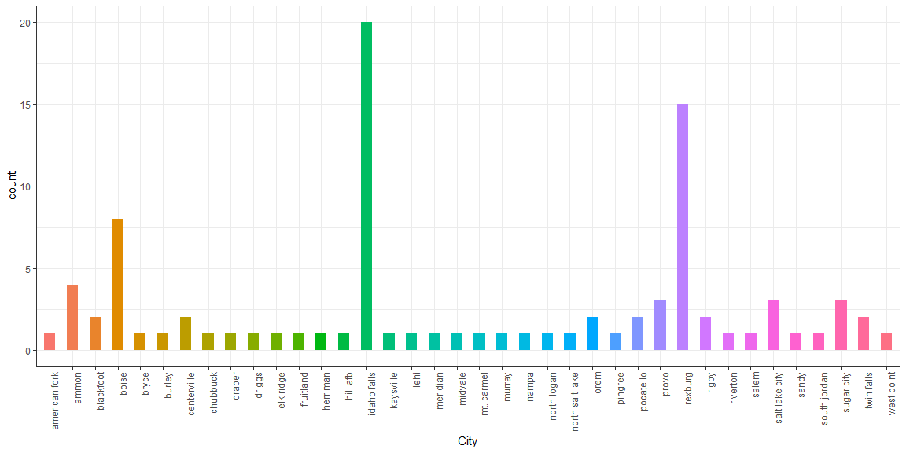

```r
# Use this R-Chunk to import all your datasets!
careerfair <- read_csv("BYUI_FallCareerFair.csv")
```

## Background

This is a summary of BYU-I career fair data

## Data Wrangling


```r
# Use this R-Chunk to clean & wrangle your data!
careerfair %>% glimpse() %>% pander()
```

```
## Observations: 175
## Variables: 21
## $ Organization                             <chr> "Accendero Software, ...
## $ City                                     <chr> "Idaho Falls", "Idaho...
## $ State                                    <chr> "Id", "ID", "ID", "AK...
## $ `Company Website Address`                <chr> "www.accendero.com", ...
## $ `College All or Specific Majors`         <chr> "Specific Majors", "S...
## $ `College Majors Ag/Life Sciences`        <chr> NA, NA, NA, NA, NA, N...
## $ `College Majors Bus/Comm`                <chr> "Business Management ...
## $ `College Majors Ed/Human Dev`            <chr> NA, "Child Developmen...
## $ `College Majors Lang/Letters`            <chr> NA, NA, NA, NA, NA, N...
## $ `College Majors Perf/Visual Arts`        <chr> NA, NA, NA, NA, NA, N...
## $ `College Majors Ph Sciences/Engineering` <chr> "Applied Mathematics ...
## $ `College Majors Found/Interd Studies`    <chr> NA, NA, NA, NA, NA, N...
## $ `Company Paragraph`                      <chr> "Accendero Software d...
## $ `Organization Type`                      <chr> "Employer", "Employer...
## $ `Cost of Tuition?`                       <chr> NA, NA, NA, NA, NA, N...
## $ `Average Time to Graduation?`            <chr> NA, NA, NA, NA, NA, N...
## $ `Industry Job Outlook?`                  <chr> NA, NA, NA, NA, NA, N...
## $ `Placement Rate?`                        <chr> NA, NA, NA, NA, NA, N...
## $ `Booths-Employer`                        <chr> "C-6", "F-4", "B-8", ...
## $ `Booths-Graduate School`                 <chr> NA, NA, NA, NA, NA, N...
## $ `Booths-On Campus Group`                 <chr> NA, NA, NA, NA, NA, N...
```


----------------------------------------------------------
          Organization                 City         State 
-------------------------------- ----------------- -------
    Accendero Software, Inc.        Idaho Falls      Id   

  Access Point Family Services      Idaho Falls      ID   

           Agri BEef                   Boise         ID   

       Alaska Coach Tours             Juneau         AK   

       Anasazi Foundation              Mesa          AZ   

  Aspen Grove Family Camp and          Provo         UT   
       Conference Center                                  

   Assisting Hands Home Care           Nampa         ID   

         Avercast, LLC                 Rigby         ID   

      Basic American Foods           Blackfoot       ID   

           BGZ brands                  Lehi          UT   

     Boise State University            Boise         ID   
        Graduate College                                  

     Book Of Mormon Central        American Fork     UT   

        Brickline Pavers            Sugar City       ID   

    Brigham Young University           Provo         UT   

    Brigham Young University           Provo         UT   

    Brigham Young University           Provo         UT   

    Brigham Young University           Provo         UT   
       Masters of Public                                  
         Administration                                   

    Brigham Young University           Provo         UT   
     Office of Information                                
           Technology                                     

    Brushbuck Wildlife Tours          Jackson        WY   

  Butler Professional Farrier        Crawford        NE   
             School                                       

    BYU Center for Language            Provo         UT   
            Studies                                       

 BYU J. Reuben Clark Law School        Provo         UT   

            BYU MBA                    Provo         UT   

   BYU Psychology Department           Provo         UT   

  BYU-David O. McKay School of         Provo         UT   
           Education                                      

  BYU-Idaho Online Employment       Sugar City       ID   

  BYU-Idaho Student Financial         Rexburg        ID   
           Aid Office                                     

  BYU-Master of Public Health          Provo         UT   
            Program                                       

            Cabela's                   Ammon         ID   

       California English            Elk Grove       CA   

  Career and Academic Advising        Rexburg        ID   

         Carriage Cove                Rexburg        ID   

      Chick-fil-A of Ammon             Ammon         ID   

         China Horizons               Rexburg        ID   

   Church of Jesus Christ of         Riverton        UT   
       Latter-day Saints                                  

      Citizens for Decency          Sugar City       ID   

      Cives Steel Company           Idaho Falls      ID   

         Clear Insights               Rexburg        ID   

      Clearwater Analytics             Boise         ID   

      Concordia Law School             Boise         ID   

    Consolidated Electrical       Spokane Valley     WA   
       Distributors, INC.                                 

   Curtiss-Wright Corporation       Idaho Falls      ID   

 Delaware North at Yellowstone        Bozeman        MT   

   Dr. Vinyl of Eastern Idaho         Rexburg        ID   

       E*TRADE Financial               Sandy         UT   

             Ecolab                  Kaysville       Ut   

          Edward Jones              Idaho Falls      ID   

  Electrical Consultants, Inc.       Billings        MT   

       Elite Health Care            Idaho Falls      ID   

 Engineering System Solutions,      Idaho Falls      ID   
              ES2                                         

        Ensign Services            MISSION VIEJO     CA   

     Enterprise Rent-A-Car            Midvale        UT   

              FBI                   Germantown       WI   

   Frazier Industrial Company       Idaho Falls      ID   

            Fybercom                Idaho Falls      ID   

      Genie, a Terex Brand            Redmond        WA   

  Gonzaga University Graduate         Spokane        WA   
       School of Business                                 

   Grand Teton Council - Boy         Pocatello       Id   
       Scouts of America                                  

          H.A.S. Inc.                  Ammon         ID   

        HAP Alaska Yukon              Seattle        WA   

   HCA/Eastern Idaho Regional        Herriman        UT   
         Medical Center                                   

     Health, Rec, and Human           Rexburg        ID   
          Performance                                     

       HELP International              Provo         UT   

      Hill AFB - Civilian            Hill AFB        UT   
          Engineering                                     

   Idaho Central Credit Union        Chubbuck        ID   

  Idaho College of Osteopathic       Meridian        ID   
            Medicine                                      

     Idaho State University          Pocatello       ID   

    Idaho State University -         Pocatello       ID   
      Nuclear Engineering                                 

    Idaho State University -         Pocatello       ID   
    Physical & Occupational                               
            Therapy                                       

 Idaho State University College      Pocatello       ID   
     of Health Professions                                

 Idaho State University College      Pocatello       ID   
          of Pharmacy                                     

     Idaho State University          Meridian        ID   
    Department of Physician                               
       Assistant Stuides                                  

    Idaho State University,          Pocatello       ID   
  College of Business Graduate                            
            Programs                                      

     Innovative Health Care         Idaho Falls      ID   
         Concepts, Inc.                                   

     International Language            Orem          UT   
            Programs                                      

         Jacob Lake Inn           Salt Lake City     UT   

       Jasper Engines and             Jasper         IN   
         Transmissions                                    

         JCPenney, Inc.           Salt Lake City     UT   

  JD Ellen Manufacturing, Inc.        Phoenix        AZ   

          Journeys DDA                 Ammon         ID   

        JP Ventures LLC              Fruitland       ID   

  Keller Williams Realty East       Idaho Falls      ID   
             Idaho                                        

  Kimberly Nurseries Landscape      Twin Falls       ID   
         and Irrigation                                   

     KNIGHT TRANSPORTATION            PHOENIX        AZ   

            LabStats                Idaho Falls      ID   

            LandCare                  Renton         WA   

          Lawn Butler               Centerville      UT   

  Leadership Academy of Nevada       Las Vegas       NV   

   Legacy Logistics - Legacy      North Salt Lake    UT   
         Transportation                                   

 Life Care Centers of America-      Federal Way      WA   
       Northwest Division                                 

 Life Chiropractic College West       Hayward        CA   

     Madison Creek Partners            Silt          CO   

   Madison Memorial Hospital          Rexburg        ID   

    Managed Wealth Financial        Idaho Falls      ID   

        MassMutual Idaho             Meridian        ID   

   Master of Human Resources,          Logan         UT   
     Utah State University                                

  Maximum Senior Benefits LLC          Salem         UT   

          McCain Foods                Burley         ID   

  McCarthy Building Companies         Phoenix        AZ   

         Melaleuca, Inc             Idaho Falls      ID   

     Micron Technology Inc.            Boise         ID   

       Monkey Bar Storage             Rexburg        ID   

    Naval Nuclear Laboratory        Idaho Falls      ID   

          NAVEX Global                Rexburg        ID   

      Nelson Laboratories         Salt Lake City     UT   

 Northwest Farm Credit Services       Spokane        WA   

      Northwestern Mutual              Boise         ID   

      Nutrien Ag Solutions            fresno         ca   

       Olympus Test Prep              Draper         UT   

        ON Semiconductor              Phoenix        AZ   

       Optisound Hearing             Pocatello       ID   

  Pacific Northwest University        Yakima         WA   
       of Health Sciences                                 

 Palmer College of Chiropractic      Davenport       IA   

       Pro Rafting Tours             Elk Ridge       UT   

 Ralph L Wadsworth Construction       Draper         UT   

              RBDC                    Rexburg        ID   

            RedBuilt                   Boise         ID   

          REDCON Inc.               Centerville      UT   

           ReviewLift                 Rexburg        ID   

    Rexburg Area Chamber of           Rexburg        ID   
            Commerce                                      

   Rexburg College of Massage         Rexburg        ID   
            Therapy                                       

    Riverbend Communications        Idaho Falls      ID   

  Rocky Mountain University of         Provo         UT   
       Health Professions                                 

        Rush Enterprises           New Braunfels     TX   

      Sandhill Media Group          Idaho Falls      ID   

        Secret MLM Hacks               Boise         ID   

   Seminaries and Institutes          Rexburg        ID   

        Smithfield Foods              Warsaw         NC   

             Soren                    Cypress        TX   

    Southern Utah Univeristy        Cedar City       ut   

   Southwest Gas Corporation         Las Vegas       NV   

       Space Dynamics Lab           North Logan      UT   

   Spudnik Equipment Company         Blackfoot       id   

    St. Luke's Health System           Boise         ID   

    Stevens Henager College           Murray         UT   

    Stevens-Henager College         Idaho Falls      ID   

        Stotz Equipment              Avondale        AZ   

             Strata                    Boise         ID   

   Strategic Social Partners        Idaho falls      ID   

         Stukent, Inc.              Idaho Falls      ID   

       T Rock Contracting             Argyle         TX   

 Teton Valley Health Care, Inc.       Driggs         ID   

   The Lodge at Bryce Canyon           Bryce         UT   

  The Sherwin-Williams Company       Bellevue        WA   

      The Yard Butler, LLC          Idaho Falls      ID   

         Topo Financial               Rexburg        ID   

         Tuck Landscape               Murray         UT   

       University of Utah         Salt Lake City     UT   

      University of Idaho           Idaho Falls      ID   

      University of Idaho           Idaho Falls      ID   

      University of Idaho              Boise         ID   

 University of Idaho College of       Moscow         ID   
              Law                                         

  University of Idaho, College        Moscow         ID   
          of Education                                    

 University of Oregon-Lundquist       Eugene         OR   
  College of Business Graduate                            
            Programs                                      

       University of Utah         Salt Lake City     UT   

  University of Utah School of       Salt Lake       UT   
            Medicine                                      

  University of Western States       Portland        OR   

  Upstream Engineering/7 Oaks       West Point       UT   
             Group                                        

              USAA                  San Antonio      TX   

     USDA-Natural Resources            Rigby         ID   
      Conservation Service                                

              USHA                     Orem          UT   

  Utah State University - CEHS         Logan         UT   

  Utah State University - MBA          Logan         UT   

     Utah Valley University            Orem          UT   

     Valley Agronomics LLC            Rexburg        id   

            Vanguard                Scottsdale       AZ   

        Wada Farms, Inc.              Pingree        ID   

       Walmart Corporate            Bentonville      AR   

     Weber State University           Layton         ut   

     Weber State University            Ogden         UT   

 Weber State University Master         Ogden         UT   
 of Science in Nursing Program                            

        Western AgCredit           South Jordan      UT   

  Western University of Health        Pomona         CA   
            Sciences                                      

    Wright Physical Therapy         Twin Falls       ID   

         Zion Ponderosa             Mt. Carmel       UT   
----------------------------------------------------------

Table: Table continues below

 
------------------------------------------------------------------------------------------------------------------------
                                                Company Website Address                                                 
------------------------------------------------------------------------------------------------------------------------
                                                   www.accendero.com                                                    

                                              http://accesspointkids.com/                                               

                                                    www.agribeef.com                                                    

                                            http://www.alaskacoachtours.com                                             

                                                    www.anasazi.org                                                     

                                                   aspengrove.byu.edu                                                   

                                                 www.assistinghands.com                                                 

                                                    www.avercast.com                                                    

                                                      www.baf.com                                                       

                                                   www.bgzbrands.com                                                    

                                        https://graduatecollege.boisestate.edu/                                         

                                                bookofmormoncentral.org                                                 

                                                  bricklinepavers.com                                                   

                                            https://graduatestudies.byu.edu                                             

                                         education.byu.edu/edlf/educationpolicy                                         

                                                      www.byu.edu                                                       

                                                      mpa.byu.edu                                                       

                                               http://oitcareers-byu.net/                                               

                                                 www.brushbucktours.com                                                 

                                                      495 Table Rd                                                      

                                                      slat.byu.edu                                                      

                                           http://www.law2.byu.edu/site/home                                            

                                          https://marriottschool.byu.edu/mba/                                           

                                                   psychology.byu.edu                                                   

                                                   education.byu.edu                                                    

                                                       PO Box 133                                                       

                                               www.byui.edu/financial-aid                                               

                                                      mph.byu.edu                                                       

                                                      Cabelas.com                                                       

                                               www.CaEnglishForChina.com                                                

                                                          NONE                                                          

                                             http://madisoncarriagecove.com                                             

                                                          NONE                                                          

                                                 www.chinahorizons.org                                                  

                                               3740 W Market Center Drive                                               

                                                     www.cfdec.org                                                      

                                                     www.cives.com                                                      

                                                 clearinsightsgroup.com                                                 

                                            http://clearwater-analytics.com/                                            

                                              http://law.cu-portland.edu/                                               

                                                     cedcareers.com                                                     

                                                 www.curtisswright.com                                                  

                                                      ygsjobs.com                                                       

                                                          none                                                          

                                                 http://www.etrade.com                                                  

                                                       Ecolab.com                                                       

                                                    edwardjones.com                                                     

                                            www.electricalconsultantsinc.com                                            

                                               https://www.elitehcn.com/                                                

                                                     www.es2eng.com                                                     

                                                  www.ensigngroup.net                                                   

                                                 www.go.enterprise.com                                                  

                                                      fbijobs.gov                                                       

                                                    www.frazier.com                                                     

                                                    www.fybercom.net                                                    

                                               https://www.genielift.com/                                               

 https://www.gonzaga.edu/Academics/Colleges-and-Schools/School-of-Business-Administration/Graduate-Programs/default.asp 

                                                 grandtetoncouncil.org                                                  

                                                www.hasincorporated.com                                                 

                                                 www.alaskatourjobs.com                                                 

                                            http://mountainstar.com/careers/                                            

                                                          NONE                                                          

                                                 help-international.org                                                 

                                                    www.hill.af.mil                                                     

                                                 www.iccu.com/careers/                                                  

                                                http://www.idahocom.org/                                                

                                                          NONE                                                          

                                                    www.engr.isu.edu                                                    

                         https://www.isu.edu/clinics/physical--occupational-therapy-associates/                         

                                                    www.isu.edu/chp                                                     

                                               https://isu.edu/pharmacy/                                                

                                                       isu.edu/pa                                                       

                                                http://www.isu.edu/cob/                                                 

                                                      ihccinc.com                                                       

                                                      www.ilp.org                                                       

                                                     jacoblake.com                                                      

                                                 www.jasperengines.com                                                  

                                                    www.jobs.jcp.com                                                    

                                                   www.jdellenmfg.com                                                   

                                                  www.journeysdda.com                                                   

                                                 incubatorwarehouse.com                                                 

                                          http://kweastidaho.yourkwoffice.com/                                          

                                                 kimberlynurseries.com                                                  

                                     http://www.knighttrans.com/Careers/index.html                                      

                                                 https://labstats.com/                                                  

                                                    www.landcare.com                                                    

                                                   WWW.LawnButler.net                                                   

                                                      www.lanv.org                                                      

                                                    legacytrans.com                                                     

                                                    http://lcca.com/                                                    

                                                      lifewest.edu                                                      

                                                     840 Grand Ave                                                      

                                                www.madisonhospital.org                                                 

                                                    www.inclined.us                                                     

                                             https://idaho.massmutual.com/                                              

                                                www.huntsman.usu.edu/mhr                                                

                                             www.maximumseniorbenefits.com                                              

                                                     www.mccain.com                                                     

                                                      mccarthy.com                                                      

                                                   www.melaleuca.com                                                    

                                                     www.micron.com                                                     

                                                    366 Dividend Dr.                                                    

                                             www.NavalNuclearLab.energy.gov                                             

                                                  www.navexglobal.com                                                   

                                                   www.nelsonlabs.com                                                   

                                                  www.northwestfcs.com                                                  

                                                  http://boise.nm.com/                                                  

                                               www.nutrienagsolutions.com                                               

                                                www.olympustestprep.com                                                 

                                      http://www.onsemi.com/PowerSolutions/home.do                                      

                                                          NONE                                                          

                                                 https://www.pnwu.edu/                                                  

                                                     www.palmer.edu                                                     

                                                www.proraftingtours.com                                                 

                                                     www.wadsco.com                                                     

                                                    35 N 1st E Ste 3                                                    

                                                    www.redbuilt.com                                                    

                                                     www.redcon.com                                                     

                                                 http://reviewlyft.com/                                                 

                                                 www.rexburgchamber.org                                                 

                                                 http://rexburgcmt.net/                                                 

                                                    www.eiradio.com                                                     

                                                       rmuohp.edu                                                       

                                                www.rushenterprises.com                                                 

                                                 sandhillmediagroup.com                                                 

                                                   secretmlmhacks.com                                                   

                                                          NONE                                                          

                                            www.smithfieldfoods.com/careers                                             

                                               https://sorentransport.com                                               

                                                        SUU.EDU                                                         

                                                       swgas.com                                                        

                                                 www.spacedynamics.org                                                  

                                                       spudnik.us                                                       

                                  https://www.stlukesonline.org/about-st-lukes/careers                                  

                                                  SHCinternational.com                                                  

                                                 www.stevenshenager.edu                                                 

                                             http://www.stotzequipment.com/                                             

                                                 www.stratageotech.com                                                  

                                            www.strategicsocialpartners.com                                             

                                                https://www.stukent.com                                                 

                                               https://dallasroofer.com/                                                

                                                    www.tvhcare.org                                                     

                                                 brycecanyonforever.com                                                 

                                                   3326 160th Ave SE                                                    

                                                   3770 American Way                                                    

                                                      147 N 2nd E                                                       

                                                 www.tucklandscape.com                                                  

                                               http://pharmacy.utah.edu/                                                

                                              1776 SCIENCE CENTER DR, TAB                                               
                                                          306                                                           

                                              1776 SCIENCE CENTER DR, TAB                                               
                                                          306                                                           

                                                          None                                                          

                                               https://www.uidaho.edu/law                                               

                        http://www.uidaho.edu/ed/ci/academic-programs/curriculum-and-instruction                        

                                             https://business.uoregon.edu/                                              

                                                    eccles.utah.edu                                                     

                               https://medicine.utah.edu/students/programs/md/admissions/                               

                                                      www.uws.edu                                                       

                                                     7oaksgroup.com                                                     

                                                      usaajobs.com                                                      

                                                   www.nrcs.usda.gov                                                    

                                             http://www.ushealthadvisor.net                                             

                                                      cehs.usu.edu                                                      

                                                    huntsmanmba.com                                                     

                                                      uvu.edu/mba                                                       

                                                   valleywidecoop.com                                                   

                                             https://www.vanguardjobs.com/                                              

                                                   www.wadafarms.com                                                    

                                                  careers.walmart.com                                                   

                                                     weber.edu/mba                                                      

                                               http://www.weber.edu/emha/                                               

                                                     weber.edu/msn                                                      

                                                www.westernagcredit.com                                                 

                                                    www.westernu.edu                                                    

                                                    www.wrightpt.com                                                    

                                                 www.zionponderosa.com                                                  
------------------------------------------------------------------------------------------------------------------------

Table: Table continues below

 
-----------------------------------------------------------------
 College All or Specific Majors       College Majors Ag/Life     
                                             Sciences            
-------------------------------- --------------------------------
        Specific Majors                         NA               

        Specific Majors                         NA               

           All Majors                           NA               

           All Majors                           NA               

           All Majors                           NA               

           All Majors                           NA               

        Specific Majors                         NA               

        Specific Majors                         NA               

           All Majors                           NA               

           All Majors                           NA               

           All Majors                           NA               

        Specific Majors                         NA               

           All Majors                           NA               

           All Majors                           NA               

           All Majors                           NA               

           All Majors                           NA               

           All Majors                           NA               

           All Majors                           NA               

           All Majors                           NA               

           All Majors                           NA               

           All Majors                           NA               

           All Majors                           NA               

           All Majors                           NA               

        Specific Majors                         NA               

           All Majors                           NA               

           All Majors                           NA               

           All Majors                           NA               

           All Majors                           NA               

           All Majors                           NA               

           All Majors                           NA               

           All Majors                           NA               

        Specific Majors              Associate of Science in     
                                   Nursing ,Bachelor of Science  
                                     in Nursing (ASN to BSN)     
                                    ,Healthcare Administration   
                                   ,Medical Assisting ,Physical  
                                    Therapy Assistant ,Public    
                                  Health,Recreation Management - 
                                      Therapeutic Recreation     

           All Majors                           NA               

           All Majors                           NA               

        Specific Majors                         NA               

           All Majors                           NA               

        Specific Majors                         NA               

           All Majors                           NA               

        Specific Majors                         NA               

           All Majors                           NA               

        Specific Majors                         NA               

        Specific Majors                         NA               

           All Majors                           NA               

        Specific Majors                         NA               

        Specific Majors                         NA               

           All Majors                           NA               

           All Majors                           NA               

        Specific Majors                         NA               

           All Majors                           NA               

        Specific Majors                         NA               

        Specific Majors              Associate of Science in     
                                   Nursing ,Bachelor of Science  
                                     in Nursing (ASN to BSN)     
                                    ,Healthcare Administration   
                                   ,Physical Therapy Assistant   

           All Majors                           NA               

           All Majors                           NA               

        Specific Majors                         NA               

        Specific Majors                         NA               

           All Majors                           NA               

        Specific Majors                         NA               

           All Majors                           NA               

           All Majors                           NA               

           All Majors                           NA               

        Specific Majors              Associate of Science in     
                                   Nursing ,Bachelor of Science  
                                     in Nursing (ASN to BSN)     

        Specific Majors                Exercise Physiology       

           All Majors                           NA               

        Specific Majors                         NA               

           All Majors                           NA               

           All Majors                           NA               

           All Majors                           NA               

        Specific Majors                         NA               

           All Majors                           NA               

           All Majors                           NA               

        Specific Majors              Associate of Science in     
                                    Nursing ,Biology ,Biology    
                                  Education,Exercise Physiology  
                                  ,Food Science ,Health Science  
                                    ,Healthcare Administration   
                                     ,Paramedicine ,Physical     
                                    Therapy Assistant ,Public    
                                  Health,Recreation Management - 
                                      Therapeutic Recreation     

           All Majors                           NA               

           All Majors                           NA               

        Specific Majors                         NA               

           All Majors                           NA               

           All Majors                           NA               

        Specific Majors                         NA               

        Specific Majors                         NA               

        Specific Majors                         NA               

        Specific Majors             Healthcare Administration    
                                    ,Public Health,Recreation    
                                      Management,Recreation      
                                     Management - Therapeutic    
                                            Recreation           

        Specific Majors                         NA               

           All Majors                           NA               

           All Majors                           NA               

        Specific Majors                         NA               

           All Majors                           NA               

        Specific Majors           AAS--Floral Design,AAS--Plant  
                                           Science and           
                                     Technology,Agricultural     
                                           Engineering           
                                     Technology,Agricultural     
                                      Technology,Agriculture     
                                   Education,Agronomy, Crop and  
                                               Soil              
                                   Sciences,Horticulture,Plant   
                                       and Wildlife Ecology      

        Specific Majors           AAS--Floral Design,AAS--Plant  
                                           Science and           
                                     Technology,Agricultural     
                                           Engineering           
                                     Technology,Agricultural     
                                      Technology,Agriculture     
                                   Education,Agronomy, Crop and  
                                       Soil Sciences,Animal      
                                  Science,Horticulture,Plant and 
                                         Wildlife Ecology        

        Specific Majors                 Biology Education        

        Specific Majors                         NA               

           All Majors                           NA               

        Specific Majors                  Biology ,Biology        
                                  Education,Exercise Physiology  
                                         ,Health Science         

        Specific Majors              Associate of Science in     
                                   Nursing ,Bachelor of Science  
                                     in Nursing (ASN to BSN)     
                                   ,Health Science ,Healthcare   
                                     Administration ,Physical    
                                        Therapy Assistant        

        Specific Majors              Associate of Science in     
                                   Nursing ,Bachelor of Science  
                                     in Nursing (ASN to BSN)     
                                    ,Healthcare Administration   

        Specific Majors                         NA               

           All Majors                           NA               

        Specific Majors                         NA               

           All Majors                           NA               

        Specific Majors               AAS--Plant Science and     
                                     Technology,Agricultural     
                                           Engineering           
                                     Technology,Agricultural     
                                      Technology,Agriculture     
                                   Education,Agronomy, Crop and  
                                    Soil Sciences,Food Science   

        Specific Majors                         NA               

        Specific Majors                    Food Science          

        Specific Majors                         NA               

           All Majors                           NA               

        Specific Majors                         NA               

        Specific Majors                         NA               

        Specific Majors                      Biology             

        Specific Majors              Agricultural Engineering    
                                     Technology,Agricultural     
                                      Technology,Agriculture     
                                   Education,Agronomy, Crop and  
                                       Soil Sciences,Animal      
                                       Science,Horticulture      

           All Majors                           NA               

        Specific Majors               AAS--Plant Science and     
                                  Technology,Agronomy, Crop and  
                                          Soil Sciences          

           All Majors                           NA               

        Specific Majors                         NA               

           All Majors                           NA               

           All Majors                           NA               

           All Majors                           NA               

           All Majors                           NA               

        Specific Majors                         NA               

           All Majors                           NA               

        Specific Majors                         NA               

        Specific Majors                         NA               

        Specific Majors                         NA               

        Specific Majors                         NA               

        Specific Majors              Associate of Science in     
                                   Nursing ,Bachelor of Science  
                                     in Nursing (ASN to BSN)     
                                    ,Exercise Physiology ,Food   
                                     Science ,Health Science     
                                    ,Healthcare Administration   
                                        ,Medical Assisting       
                                      ,Occupational Safety &     
                                  Health,Paramedicine ,Physical  
                                    Therapy Assistant ,Public    
                                        Health,Recreation        
                                      Management,Recreation      
                                     Management - Therapeutic    
                                            Recreation           

           All Majors                           NA               

        Specific Majors              Associate of Science in     
                                   Nursing ,Bachelor of Science  
                                     in Nursing (ASN to BSN)     
                                        ,Biology ,Biology        
                                  Education,Exercise Physiology  
                                     ,Health Science ,Medical    
                                     Assisting ,Paramedicine     
                                   ,Physical Therapy Assistant   

           All Majors                           NA               

        Specific Majors                         NA               

        Specific Majors                         NA               

           All Majors                           NA               

        Specific Majors              Agronomy, Crop and Soil     
                                   Sciences,Animal Science,Food  
                                             Science             

        Specific Majors                         NA               

           All Majors                           NA               

        Specific Majors                         NA               

        Specific Majors                         NA               

           All Majors                           NA               

           All Majors                           NA               

           All Majors                           NA               

        Specific Majors              Associate of Science in     
                                   Nursing ,Bachelor of Science  
                                     in Nursing (ASN to BSN)     

        Specific Majors              Agricultural Technology     

        Specific Majors                         NA               

        Specific Majors                         NA               

        Specific Majors                         NA               

        Specific Majors                         NA               

           All Majors                           NA               

           All Majors                           NA               

           All Majors                           NA               

        Specific Majors                    Horticulture          

           All Majors                           NA               

           All Majors                           NA               

           All Majors                           NA               

           All Majors                           NA               

           All Majors                           NA               

           All Majors                           NA               

           All Majors                           NA               

           All Majors                           NA               

        Specific Majors                         NA               

           All Majors                           NA               

           All Majors                           NA               

           All Majors                           NA               

        Specific Majors                         NA               

           All Majors                           NA               

        Specific Majors                    Agricultural          
                                      Technology,Agriculture     
                                   Education,Agronomy, Crop and  
                                       Soil Sciences,Animal      
                                    Science,Biology ,Plant and   
                                         Wildlife Ecology        

        Specific Majors                         NA               

           All Majors                           NA               

           All Majors                           NA               

           All Majors                           NA               

        Specific Majors                AAS--Beef Production      
                                  Management,AAS--Plant Science  
                                   and Technology,Agricultural   
                                           Engineering           
                                     Technology,Agricultural     
                                      Technology,Agriculture     
                                   Education,Agronomy, Crop and  
                                       Soil Sciences,Animal      
                                       Science,Horticulture      

           All Majors                           NA               

        Specific Majors              Agricultural Engineering    
                                     Technology,Agricultural     
                                  Technology,Agronomy, Crop and  
                                          Soil Sciences          

        Specific Majors                         NA               

           All Majors                           NA               

        Specific Majors             Healthcare Administration    

        Specific Majors              Associate of Science in     
                                   Nursing ,Bachelor of Science  
                                     in Nursing (ASN to BSN)     

        Specific Majors                         NA               

           All Majors                           NA               

        Specific Majors             Physical Therapy Assistant   

           All Majors                           NA               
-----------------------------------------------------------------

Table: Table continues below

 
------------------------------------------------------------------
     College Majors Bus/Comm        College Majors Ed/Human Dev   
--------------------------------- --------------------------------
      Business Management -                      NA               
    Marketing,Communication -                                     
   Advertising,Communication -                                    
 Public Relations,Communication                                   
     - Visual Communication                                       

               NA                     Child Development ,Early    
                                    Childhood/Special Education   
                                   ,Elementary Education,Family & 
                                     Consumer Science Education   
                                         Composite ,Health        
                                   Psychology,Marriage and Family 
                                       Studies ,Professional      
                                        Preschool Education       
                                       ,Psychology - General      
                                      Psychology,Psychology -     
                                     Industrial/Organizational    
                                       Psychology,Social Work     
                                   ,Sociology ,Special Education  
                                                K-12              

               NA                                NA               

               NA                                NA               

               NA                                NA               

               NA                                NA               

       AAS-Administrative             Child Development ,Early    
        Assistant/Office            Childhood/Special Education   
   Manager,Business Analytics                 ,Health             
                                      Psychology,Professional     
                                        Preschool Education       
                                       ,Psychology - General      
                                       Psychology,Social Work     
                                   ,Sociology ,Special Education  
                                                K-12              

  Business Analytics ,Business                   NA               
  Management - Finance,Business                                   
          Management -                                            
  Marketing,Business Management                                   
         - Supply Chain                                           
   Management,Communication -                                     
   Advertising,Communication -                                    
 Public Relations,Communication                                   
            - Visual                                              
     Communication,Economics                                      
      ,Financial Economics                                        

               NA                                NA               

               NA                                NA               

               NA                                NA               

      Communication - Video                      NA               
   Production,Communication -                                     
      Visual Communication                                        

               NA                                NA               

               NA                                NA               

               NA                                NA               

               NA                                NA               

               NA                                NA               

               NA                                NA               

               NA                                NA               

               NA                                NA               

               NA                                NA               

               NA                                NA               

               NA                                NA               

               NA                       Psychology - General      
                                      Psychology,Psychology -     
                                     Industrial/Organizational    
                                             Psychology           

               NA                                NA               

               NA                                NA               

               NA                                NA               

               NA                                NA               

               NA                                NA               

               NA                                NA               

               NA                                NA               

      Business Management -                      NA               
            Marketing                                             

               NA                                NA               

               NA                                NA               

  Business Analytics ,Business                   NA               
    Management - Supply Chain                                     
           Management                                             

               NA                                NA               

               NA                                NA               

               NA                                NA               

               NA                                NA               

               NA                                NA               

       AAS-Administrative                        NA               
        Assistant/Office                                          
 Manager,Accounting,Agribusiness                                  
         - Agribusiness                                           
    Management,Agribusiness -                                     
  Global Food and Agribusiness                                    
     Management,Agricultural                                      
  Economics ,Applied Management                                   
  ,Business Analytics ,Business                                   
  Management - Entrepreneurial                                    
 Management,Business Management                                   
  - Finance,Business Management                                   
      - Marketing,Business                                        
    Management - Supply Chain                                     
   Management,Communication -                                     
   Advertising,Communication -                                    
  News/Journalism,Communication                                   
 - Organizational Communication                                   
  and Advocacy,Communication -                                    
 Public Relations,Communication                                   
             - Video                                              
   Production,Communication -                                     
 Visual Communication,Economics                                   
      ,Financial Economics                                        

               NA                                NA               

               NA                                NA               

  Applied Management ,Business                   NA               
  Management - Entrepreneurial                                    
 Management,Business Management                                   
           - Marketing                                            

  Accounting,Applied Management                  NA               
  ,Business Analytics ,Business                                   
  Management - Entrepreneurial                                    
 Management,Business Management                                   
  - Finance,Business Management                                   
      - Marketing,Business                                        
    Management - Supply Chain                                     
      Management,Economics                                        
      ,Financial Economics                                        

               NA                                NA               

               NA                                NA               

               NA                                NA               

               NA                                NA               

               NA                                NA               

  Accounting,Applied Management                  NA               
     ,Business Management -                                       
         Entrepreneurial                                          
 Management,Business Management                                   
  - Finance,Business Management                                   
      - Marketing,Business                                        
    Management - Supply Chain                                     
           Management                                             

               NA                                NA               

               NA                                NA               

               NA                                NA               

       AAS-Administrative                        NA               
        Assistant/Office                                          
       Manager,Accounting                                         

               NA                                NA               

       AAS-Administrative                        NA               
        Assistant/Office                                          
 Manager,Accounting,Agribusiness                                  
         - Agribusiness                                           
    Management,Agribusiness -                                     
  Global Food and Agribusiness                                    
     Management,Agricultural                                      
  Economics ,Applied Management                                   
  ,Business Analytics ,Business                                   
  Management - Entrepreneurial                                    
 Management,Business Management                                   
  - Finance,Business Management                                   
      - Marketing,Business                                        
    Management - Supply Chain                                     
   Management,Communication -                                     
   Advertising,Communication -                                    
  News/Journalism,Communication                                   
 - Organizational Communication                                   
  and Advocacy,Communication -                                    
 Public Relations,Communication                                   
             - Video                                              
   Production,Communication -                                     
 Visual Communication,Economics                                   
      ,Financial Economics                                        

               NA                                NA               

               NA                                NA               

               NA                                NA               

               NA                                NA               

               NA                                NA               

               NA                                NA               

               NA                                NA               

               NA                                NA               

               NA                                NA               

               NA                                NA               

               NA                                NA               

               NA                                NA               

               NA                                NA               

  Accounting,Applied Management                  NA               
     ,Business Management -                                       
         Entrepreneurial                                          
 Management,Business Management                                   
  - Finance,Business Management                                   
      - Marketing,Business                                        
    Management - Supply Chain                                     
           Management                                             

               NA                                NA               

               NA                                NA               

               NA                     Child Development ,Early    
                                    Childhood/Special Education   
                                    ,Elementary Education,Health  
                                   Psychology,Marriage and Family 
                                   Studies ,Psychology - General  
                                       Psychology,Social Work     
                                   ,Sociology ,Special Education  
                                                K-12              

               NA                                NA               

               NA                                NA               

  Applied Management ,Business                   NA               
    Management - Supply Chain                                     
           Management                                             

 Accounting,Business Management                  NA               
            - Finance                                             

               NA                                NA               

               NA                     Child Development ,Early    
                                    Childhood/Special Education   
                                    ,Marriage and Family Studies  
                                       ,Psychology - General      
                                      Psychology,Psychology -     
                                     Industrial/Organizational    
                                       Psychology,Social Work     
                                   ,Sociology ,Special Education  
                                                K-12              

  Applied Management ,Business                   NA               
 Analytics ,Business Management                                   
      - Marketing,Business                                        
    Management - Supply Chain                                     
   Management,Communication -                                     
        Video Production                                          

               NA                                NA               

               NA                                NA               

 Accounting,Business Management                  NA               
  - Finance,Business Management                                   
      - Marketing,Business                                        
    Management - Supply Chain                                     
   Management,Communication -                                     
           Advertising                                            

               NA                                NA               

   Agribusiness - Agribusiness                   NA               
     Management,Agricultural                                      
 Economics ,Business Management                                   
        - Entrepreneurial                                         
 Management,Business Management                                   
  - Finance,Business Management                                   
      - Marketing,Economics                                       

  Accounting,Business Analytics         Psychology - General      
     ,Business Management -           Psychology,Psychology -     
  Finance,Business Management -      Industrial/Organizational    
            Marketing                        Psychology           

               NA                   Elementary Education,Special  
                                           Education K-12         

      Business Management -                      NA               
         Entrepreneurial                                          
 Management,Business Management                                   
    - Supply Chain Management                                     

               NA                                NA               

               NA                                NA               

  Accounting,Business Analytics             Social Work           
     ,Business Management -                                       
         Entrepreneurial                                          
 Management,Business Management                                   
  - Finance,Business Management                                   
      - Marketing,Business                                        
    Management - Supply Chain                                     
           Management                                             

 Accounting,Business Management                  NA               
    - Supply Chain Management                                     

 Accounting,Business Management                  NA               
        - Entrepreneurial                                         
 Management,Business Management                                   
  - Finance,Business Management                                   
   - Marketing,Communication -                                    
   Advertising,Communication -                                    
   Public Relations,Financial                                     
            Economics                                             

               NA                                NA               

  Accounting,Applied Management         Psychology - General      
  ,Business Analytics ,Business       Psychology,Psychology -     
  Management - Entrepreneurial       Industrial/Organizational    
 Management,Business Management        Psychology,Social Work     
  - Finance,Business Management              ,Sociology           
      - Marketing,Business                                        
    Management - Supply Chain                                     
   Management,Communication -                                     
  Organizational Communication                                    
  and Advocacy,Communication -                                    
   Public Relations,Economics                                     
      ,Financial Economics                                        

               NA                                NA               

   Agribusiness - Agribusiness                   NA               
    Management,Agribusiness -                                     
  Global Food and Agribusiness                                    
     Management,Agricultural                                      
  Economics ,Applied Management                                   
  ,Business Management - Supply                                   
        Chain Management                                          

               NA                                NA               

  Accounting,Business Analytics                  NA               
     ,Business Management -                                       
         Entrepreneurial                                          
 Management,Business Management                                   
  - Finance,Business Management                                   
      - Marketing,Business                                        
    Management - Supply Chain                                     
      Management,Economics                                        
      ,Financial Economics                                        

               NA                                NA               

               NA                                NA               

               NA                                NA               

      Business Management -                      NA               
  Finance,Business Management -                                   
            Marketing                                             

               NA                                NA               

    Accounting,Agribusiness -                    NA               
          Agribusiness                                            
    Management,Agribusiness -                                     
  Global Food and Agribusiness                                    
     Management,Agricultural                                      
 Economics ,Business Management                                   
 - Finance,Economics ,Financial                                   
            Economics                                             

               NA                                NA               

               NA                                NA               

               NA                                NA               

  Accounting,Business Analytics                  NA               
     ,Business Management -                                       
  Finance,Business Management -                                   
     Supply Chain Management                                      

               NA                                NA               

               NA                                NA               

               NA                                NA               

               NA                                NA               

               NA                                NA               

               NA                                NA               

               NA                                NA               

       AAS-Administrative                        NA               
        Assistant/Office                                          
   Manager,Accounting,Applied                                     
      Management ,Business                                        
     Management - Marketing                                       

       AAS-Administrative                        NA               
        Assistant/Office                                          
   Manager,Applied Management                                     
  ,Business Analytics ,Business                                   
  Management - Entrepreneurial                                    
 Management,Business Management                                   
      - Marketing,Business                                        
    Management - Supply Chain                                     
   Management,Communication -                                     
   Advertising,Communication -                                    
  News/Journalism,Communication                                   
            - Public                                              
    Relations,Communication -                                     
 Video Production,Communication                                   
     - Visual Communication                                       

      Business Management -                      NA               
 Finance,Communication - Public                                   
            Relations                                             

               NA                                NA               

               NA                                NA               

               NA                                NA               

               NA                                NA               

      Business Management -                      NA               
         Entrepreneurial                                          
   Management,Communication -                                     
   Advertising,Communication -                                    
  News/Journalism,Communication                                   
 - Organizational Communication                                   
  and Advocacy,Communication -                                    
        Public Relations                                          

      Business Management -                      NA               
         Entrepreneurial                                          
 Management,Business Management                                   
   - Marketing,Communication -                                    
   Advertising,Communication -                                    
        Video Production                                          

               NA                                NA               

               NA                                NA               

  Business Analytics ,Business                   NA               
  Management - Finance,Business                                   
          Management -                                            
  Marketing,Business Management                                   
         - Supply Chain                                           
      Management,Economics                                        
      ,Financial Economics                                        

               NA                                NA               

               NA                                NA               

               NA                                NA               

               NA                                NA               

               NA                                NA               

               NA                                NA               

 Accounting,Business Management                  NA               
  - Entrepreneurial Management                                    

   Agribusiness - Agribusiness                   NA               
    Management,Agribusiness -                                     
  Global Food and Agribusiness                                    
     Management,Agricultural                                      
  Economics ,Business Analytics                                   
  ,Business Management - Supply                                   
        Chain Management                                          

               NA                                NA               

       AAS-Administrative                        NA               
        Assistant/Office                                          
  Manager,Business Management -                                   
         Entrepreneurial                                          
 Management,Business Management                                   
   - Marketing,Communication -                                    
   Advertising,Communication -                                    
  Organizational Communication                                    
  and Advocacy,Communication -                                    
 Public Relations,Communication                                   
             - Video                                              
   Production,Communication -                                     
      Visual Communication                                        

       AAS-Administrative                        NA               
        Assistant/Office                                          
   Manager,Applied Management                                     
  ,Business Analytics ,Business                                   
  Management - Entrepreneurial                                    
 Management,Business Management                                   
      - Marketing,Business                                        
    Management - Supply Chain                                     
   Management,Communication -                                     
   Advertising,Communication -                                    
  Organizational Communication                                    
  and Advocacy,Communication -                                    
 Public Relations,Communication                                   
     - Visual Communication                                       

  Applied Management ,Business                   NA               
  Management - Entrepreneurial                                    
 Management,Business Management                                   
   - Marketing,Communication -                                    
           Advertising                                            

               NA                                NA               

               NA                                NA               

               NA                                NA               

  Applied Management ,Business                   NA               
     Management - Marketing                                       

               NA                                NA               

               NA                                NA               

               NA                                NA               

               NA                                NA               

               NA                                NA               

               NA                                NA               

               NA                                NA               

               NA                                NA               

  Accounting,Business Analytics                  NA               
     ,Business Management -                                       
         Entrepreneurial                                          
 Management,Business Management                                   
  - Finance,Business Management                                   
      - Marketing,Business                                        
    Management - Supply Chain                                     
      Management,Economics                                        
      ,Financial Economics                                        

               NA                                NA               

               NA                                NA               

               NA                                NA               

               NA                                NA               

               NA                                NA               

   Agribusiness - Agribusiness                   NA               
     Management,Agricultural                                      
   Economics ,Communication -                                     
        Public Relations                                          

  Accounting,Applied Management                  NA               
  ,Business Analytics ,Business                                   
  Management - Entrepreneurial                                    
 Management,Business Management                                   
  - Finance,Business Management                                   
   - Marketing,Communication -                                    
   Advertising,Communication -                                    
 Visual Communication,Economics                                   
      ,Financial Economics                                        

               NA                                NA               

               NA                                NA               

               NA                                NA               

               NA                                NA               

               NA                                NA               

   Agribusiness - Agribusiness                   NA               
    Management,Agribusiness -                                     
  Global Food and Agribusiness                                    
           Management                                             

               NA                                NA               

               NA                                NA               

      Business Management -                      NA               
         Entrepreneurial                                          
 Management,Business Management                                   
  - Finance,Business Management                                   
      - Marketing,Business                                        
    Management - Supply Chain                                     
      Management,Economics                                        
      ,Financial Economics                                        

               NA                                NA               

   Agribusiness - Agribusiness                   NA               
    Management,Agribusiness -                                     
  Global Food and Agribusiness                                    
     Management,Agricultural                                      
            Economics                                             

               NA                                NA               

               NA                                NA               

               NA                                NA               
------------------------------------------------------------------

Table: Table continues below

 
-----------------------------------------------------------------
  College Majors Lang/Letters      College Majors Perf/Visual    
                                              Arts               
------------------------------- ---------------------------------
              NA                               NA                

              NA                               NA                

              NA                               NA                

              NA                               NA                

              NA                               NA                

              NA                               NA                

              NA                               NA                

              NA                               NA                

              NA                               NA                

              NA                               NA                

              NA                               NA                

  English ,English Education                   NA                
      ,English Education                                         
   Composite,History,History                                     
 Education ,Humanities ,Social                                   
  Studies Education Composite                                    
      ,Spanish Education                                         

              NA                               NA                

              NA                               NA                

              NA                               NA                

              NA                               NA                

              NA                               NA                

              NA                               NA                

              NA                               NA                

              NA                               NA                

              NA                               NA                

              NA                               NA                

              NA                               NA                

              NA                               NA                

              NA                               NA                

              NA                               NA                

              NA                               NA                

              NA                               NA                

              NA                               NA                

              NA                               NA                

              NA                               NA                

              NA                               NA                

              NA                               NA                

              NA                               NA                

              NA                         Graphic Design          

              NA                               NA                

              NA                               NA                

              NA                               NA                

              NA                               NA                

              NA                               NA                

              NA                               NA                

              NA                               NA                

              NA                               NA                

              NA                               NA                

              NA                               NA                

              NA                               NA                

              NA                               NA                

              NA                               NA                

              NA                               NA                

              NA                               NA                

              NA                               NA                

              NA                               NA                

              NA                               NA                

              NA                               NA                

              NA                               NA                

              NA                               NA                

              NA                               NA                

              NA                               NA                

              NA                               NA                

              NA                               NA                

              NA                               NA                

              NA                               NA                

              NA                               NA                

              NA                               NA                

              NA                               NA                

              NA                               NA                

              NA                               NA                

              NA                               NA                

              NA                               NA                

              NA                               NA                

              NA                               NA                

              NA                               NA                

              NA                               NA                

              NA                               NA                

              NA                               NA                

              NA                               NA                

              NA                               NA                

              NA                               NA                

              NA                               NA                

              NA                               NA                

              NA                               NA                

              NA                               NA                

              NA                               NA                

              NA                               NA                

              NA                               NA                

              NA                               NA                

              NA                               NA                

  English Education ,English          Art Education ,Music       
  Education Composite,History     Education,Theatre and Speech   
   Education ,Social Studies                Education            
      Education Composite                                        

              NA                               NA                

              NA                               NA                

              NA                               NA                

              NA                               NA                

              NA                               NA                

              NA                               NA                

              NA                               NA                

              NA                               NA                

              NA                               NA                

              NA                               NA                

              NA                               NA                

              NA                               NA                

              NA                               NA                

              NA                               NA                

              NA                               NA                

              NA                               NA                

              NA                               NA                

              NA                               NA                

              NA                               NA                

              NA                               NA                

              NA                               NA                

              NA                               NA                

              NA                               NA                

              NA                               NA                

              NA                               NA                

              NA                               NA                

              NA                               NA                

              NA                               NA                

              NA                               NA                

              NA                               NA                

              NA                         Drawing,Graphic         
                                 Design,Illustration,Photography 

     International Studies                     NA                

              NA                               NA                

              NA                               NA                

              NA                               NA                

              NA                               NA                

              NA                               NA                

              NA                               NA                

              NA                               NA                

              NA                               NA                

              NA                               NA                

              NA                               NA                

              NA                               NA                

              NA                               NA                

              NA                               NA                

              NA                               NA                

              NA                               NA                

              NA                               NA                

              NA                               NA                

              NA                               NA                

              NA                               NA                

            English                      Graphic Design          

              NA                               NA                

              NA                               NA                

              NA                               NA                

              NA                               NA                

              NA                               NA                

              NA                               NA                

              NA                               NA                

              NA                               NA                

              NA                               NA                

              NA                               NA                

              NA                               NA                

              NA                               NA                

              NA                               NA                

              NA                               NA                

              NA                               NA                

              NA                               NA                

              NA                               NA                

              NA                               NA                

              NA                               NA                

              NA                               NA                

              NA                               NA                

              NA                               NA                

              NA                               NA                

              NA                               NA                

              NA                               NA                

              NA                               NA                

              NA                               NA                

              NA                               NA                

              NA                               NA                

              NA                               NA                

              NA                               NA                

              NA                               NA                

              NA                               NA                

              NA                               NA                

              NA                               NA                
-----------------------------------------------------------------

Table: Table continues below

 
--------------------------------------------------------------------
         College Majors Ph             College Majors Found/Interd  
        Sciences/Engineering                     Studies            
------------------------------------ -------------------------------
    Applied Mathematics ,Applied                   NA               
              Software                                              
 Engineering,Biostatistics,Computer                                 
   Engineering ,Computer Science                                    
           ,Mathematical                                            
   Sciences,Software Engineering                                    
   ,Web Design and Development -                                    
       Design,Web Design and                                        
     Development - Development                                      

                 NA                                NA               

                 NA                                NA               

                 NA                                NA               

                 NA                                NA               

                 NA                                NA               

                 NA                          General Studies        
                                       ,Interdisciplinary Studies   
                                           ,University Studies      

     AAS--Computer Information                     NA               
       Systems,AAS--Computer                                        
       Programming,AAS--Data                                        
    Science,Applied Mathematics                                     
         ,Applied Software                                          
        Engineering,Computer                                        
       Engineering ,Computer                                        
            Information                                             
    Technology,Computer Science                                     
     ,Manufacturing and Supply                                      
         Chain,Mathematical                                         
   Sciences,Software Engineering                                    
   ,Web Design and Development -                                    
       Design,Web Design and                                        
     Development - Development                                      

                 NA                                NA               

                 NA                                NA               

                 NA                                NA               

                 NA                                NA               

                 NA                                NA               

                 NA                                NA               

                 NA                                NA               

                 NA                                NA               

                 NA                                NA               

                 NA                                NA               

                 NA                                NA               

                 NA                                NA               

                 NA                                NA               

                 NA                                NA               

                 NA                                NA               

                 NA                                NA               

                 NA                                NA               

                 NA                                NA               

                 NA                                NA               

                 NA                                NA               

                 NA                                NA               

                 NA                                NA               

                 NA                                NA               

                 NA                                NA               

                 NA                                NA               

                 NA                                NA               

     AAS--Computer Information                     NA               
       Systems,AAS--Computer                                        
       Programming,AAS--Data                                        
    Science,AAS--Electrical and                                     
              Computer                                              
    Engineering,AAS--Engineering                                    
   Technology,Applied Mathematics                                   
         ,Applied Software                                          
        Engineering,Computer                                        
       Engineering ,Computer                                        
            Information                                             
    Technology,Computer Science                                     
       ,Data Science,Software                                       
    Engineering ,Web Design and                                     
      Development - Design,Web                                      
      Design and Development -                                      
            Development                                             

                 NA                                NA               

      AAS--Welding Engineering                     NA               
          Technology,Civil                                          
      Engineering,Construction                                      
             Management                                             

                 NA                                NA               

   Computer Engineering ,Computer                  NA               
   Science ,Software Engineering                                    

                 NA                                NA               

                 NA                                NA               

        Computer Engineering                       NA               
      ,Electrical Engineering                                       
       ,Software Engineering                                        

                 NA                                NA               

                 NA                                NA               

                 NA                                NA               

                 NA                                NA               

                 NA                                NA               

    Civil Engineering,Electrical                   NA               
            Engineering                                             

                 NA                                NA               

    Civil Engineering,Electrical                   NA               
      Engineering ,Mechanical                                       
            Engineering                                             

                 NA                                NA               

                 NA                                NA               

                 NA                                NA               

      AAS--Welding Engineering                     NA               
      Technology,Construction                                       
   Management ,Manufacturing and                                    
      Supply Chain,Welding and                                      
       Fabrication Technology                                       
        Management ,Welding                                         
       Engineering Technology                                       

     AAS--Computer Information                     NA               
       Systems,AAS--Computer                                        
       Programming,AAS--Data                                        
    Science,AAS--Electrical and                                     
              Computer                                              
    Engineering,AAS--Engineering                                    
        Technology,Computer                                         
       Engineering ,Computer                                        
       Information Technology                                       

                 NA                                NA               

                 NA                                NA               

                 NA                                NA               

                 NA                                NA               

                 NA                                NA               

                 NA                                NA               

                 NA                                NA               

                 NA                                NA               

   Computer Engineering ,Computer                  NA               
        Science ,Electrical                                         
      Engineering ,Mechanical                                       
            Engineering                                             

                 NA                                NA               

                 NA                                NA               

                 NA                                NA               

                 NA                                NA               

                 NA                                NA               

                 NA                                NA               

            Biochemistry                           NA               
      ,Biostatistics,Chemistry                                      
        ,Chemistry Education                                        

                 NA                                NA               

                 NA                                NA               

                 NA                                NA               

                 NA                                NA               

                 NA                                NA               

          Advanced Vehicle                         NA               
   Systems,Automotive Engineering                                   
       Technology,Automotive                                        
       Technology ,Automotive                                       
             Technology                                             
    Management,Manufacturing and                                    
      Supply Chain,Mechanical                                       
            Engineering                                             

    Civil Engineering,Electrical                   NA               
            Engineering                                             

          AAS--Engineering                         NA               
        Technology,Computer                                         
       Engineering ,Computer                                        
            Information                                             
    Technology,Computer Science                                     
      ,Electrical Engineering                                       
     ,Manufacturing and Supply                                      
    Chain,Mechanical Engineering                                    
       ,Software Engineering                                        

                 NA                                NA               

           AAS--Computer                           NA               
    Programming,AAS--Electrical                                     
            and Computer                                            
    Engineering,Applied Software                                    
        Engineering,Computer                                        
      Engineering ,Electrical                                       
   Engineering ,Manufacturing and                                   
      Supply Chain,Mechanical                                       
    Engineering ,Web Design and                                     
      Development - Design,Web                                      
      Design and Development -                                      
            Development                                             

                 NA                                NA               

                 NA                                NA               

                 NA                                NA               

                 NA                                NA               

                 NA                                NA               

     AAS--Computer Information        AAS - Family History ,General 
       Systems,AAS--Computer           Studies ,Interdisciplinary   
       Programming,AAS--Data           Studies ,University Studies  
    Science,AAS--Electrical and                                     
              Computer                                              
    Engineering,AAS--Engineering                                    
      Technology,AAS--Welding                                       
   Engineering Technology,Applied                                   
   Software Engineering,Computer                                    
            Information                                             
    Technology,Computer Science                                     
   ,Construction Management ,Data                                   
       Science,Earth Science                                        
      Education ,Environmental                                      
        Geoscience,Software                                         
    Engineering ,Web Design and                                     
      Development - Design,Web                                      
      Design and Development -                                      
      Development,Welding and                                       
       Fabrication Technology                                       
        Management ,Welding                                         
       Engineering Technology                                       

     Chemistry Education ,Earth                    NA               
   Science Education ,Mathematics                                   
    Education ,Physics Education                                    

                 NA                                NA               

                 NA                                NA               

                 NA                                NA               

                 NA                                NA               

                 NA                                NA               

                 NA                                NA               

                 NA                                NA               

                 NA                                NA               

                 NA                                NA               

   Manufacturing and Supply Chain                  NA               

      Architectural Technology                     NA               
               ,Civil                                               
      Engineering,Construction                                      
       Management ,Mechanical                                       
            Engineering                                             

          Applied Software                         NA               
        Engineering,Computer                                        
            Information                                             
    Technology,Computer Science                                     
    ,Data Science,Manufacturing                                     
     and Supply Chain,Software                                      
    Engineering ,Web Design and                                     
      Development - Design,Web                                      
      Design and Development -                                      
            Development                                             

        Chemistry ,Computer                        NA               
   Engineering ,Computer Science                                    
      ,Electrical Engineering                                       
      ,Mechanical Engineering                                       
              ,Physics                                              

                 NA                                NA               

    Civil Engineering,Electrical                   NA               
      Engineering ,Mechanical                                       
            Engineering                                             

        Computer Information                       NA               
    Technology,Computer Science                                     
     ,Software Engineering ,Web                                     
      Design and Development -                                      
       Design,Web Design and                                        
     Development - Development                                      

      Biochemistry ,Chemistry                      NA               

                 NA                                NA               

                 NA                                NA               

                 NA                                NA               

                 NA                                NA               

     AAS--Computer Information                     NA               
         Systems,AAS--Data                                          
    Science,AAS--Electrical and                                     
              Computer                                              
    Engineering,AAS--Engineering                                    
    Technology,Applied Software                                     
         Engineering,Civil                                          
       Engineering,Electrical                                       
      Engineering ,Mechanical                                       
       Engineering ,Software                                        
            Engineering                                             

                 NA                                NA               

                 NA                                NA               

                 NA                                NA               

                 NA                                NA               

          AAS--Engineering                         NA               
      Technology,AAS--Welding                                       
            Engineering                                             
    Technology,Advanced Vehicle                                     
   Systems,Automotive Engineering                                   
       Technology,Automotive                                        
       Technology ,Automotive                                       
    Technology Management,Civil                                     
      Engineering,Construction                                      
      Management ,Welding and                                       
       Fabrication Technology                                       
        Management ,Welding                                         
       Engineering Technology                                       

                 NA                                NA               

          AAS--Engineering                         NA               
      Technology,Architectural                                      
      Technology ,Construction                                      
             Management                                             

             AAS--Data                             NA               
       Science,Architectural                                        
      Technology ,Construction                                      
    Management ,Geobusiness and                                     
     Data Analytics,Geoscience                                      
   Computing,Geospatial Computing                                   

   Computer Engineering ,Computer                  NA               
            Information                                             
    Technology,Computer Science                                     
       ,Data Science,Software                                       
    Engineering ,Web Design and                                     
      Development - Design,Web                                      
      Design and Development -                                      
            Development                                             

                 NA                                NA               

                 NA                                NA               

                 NA                                NA               

                 NA                                NA               

                 NA                                NA               

   Computer Engineering ,Computer                  NA               
            Information                                             
    Technology,Computer Science                                     

                 NA                                NA               

                 NA                                NA               

                 NA                                NA               

                 NA                                NA               

                 NA                                NA               

      Construction Management                      NA               

   Computer Engineering ,Computer                  NA               
            Information                                             
    Technology,Computer Science                                     
      ,Electrical Engineering                                       
      ,Mechanical Engineering                                       
     ,Software Engineering ,Web                                     
      Design and Development -                                      
       Design,Web Design and                                        
     Development - Development                                      

                 NA                                NA               

                 NA                                NA               

                 NA                                NA               

                 NA                                NA               

                 NA                                NA               

          AAS--Engineering                         NA               
      Technology,AAS--Welding                                       
    Engineering Technology,Civil                                    
      Engineering,Construction                                      
        Management ,Geology                                         

                 NA                                NA               

                 NA                                NA               

      Construction Management              University Studies       

                 NA                                NA               

                 NA                                NA               

                 NA                                NA               

      Construction Management                      NA               

                 NA                                NA               

                 NA                                NA               

                 NA                                NA               

                 NA                                NA               

                 NA                                NA               

                 NA                                NA               

                 NA                                NA               

                 NA                                NA               

                 NA                                NA               

                 NA                                NA               

                 NA                                NA               

                 NA                                NA               

     AAS--Computer Information                     NA               
       Systems,AAS--Computer                                        
       Programming,AAS--Data                                        
      Science,AAS--Engineering                                      
    Technology,Applied Software                                     
        Engineering,Computer                                        
       Engineering ,Computer                                        
            Information                                             
    Technology,Computer Science                                     
       ,Data Science,Software                                       
    Engineering ,Web Design and                                     
      Development - Design,Web                                      
      Design and Development -                                      
            Development                                             

                 NA                                NA               

         Civil Engineering                         NA               

                 NA                          General Studies        

                 NA                                NA               

                 NA                                NA               

                 NA                                NA               

                 NA                                NA               

                 NA                                NA               

          AAS--Engineering                         NA               
      Technology,AAS--Welding                                       
            Engineering                                             
       Technology,Mechanical                                        
            Engineering                                             

     AAS--Computer Information                     NA               
       Systems,AAS--Computer                                        
       Programming,AAS--Data                                        
    Science,AAS--Electrical and                                     
              Computer                                              
    Engineering,AAS--Engineering                                    
    Technology,Applied Software                                     
        Engineering,Computer                                        
       Engineering ,Computer                                        
            Information                                             
    Technology,Computer Science                                     
       ,Data Science,Software                                       
    Engineering ,Web Design and                                     
      Development - Design,Web                                      
      Design and Development -                                      
            Development                                             

                 NA                                NA               

                 NA                                NA               

                 NA                                NA               

                 NA                                NA               

                 NA                                NA               

                 NA                                NA               

                 NA                                NA               
--------------------------------------------------------------------

Table: Table continues below

 
-----------------------------------------------------------------
          Company Paragraph                Organization Type     
------------------------------------- ---------------------------
   Accendero Software designs and              Employer          
       implements fully custom                                   
   software solutions for clients                                
        in the Biotechnical,                                     
    Pharmaceutical, and Advanced                                 
     Manufacturing Spheres.  We                                  
      specialize in laboratory                                   
       information management                                    
     systems, visualization and                                  
       reporting systems, data                                   
       science consulting and                                    
       advanced manufacturing                                    
     workflow solutions.  We are                                 
    located in eastern Idaho and                                 
    provide a relaxed atmosphere                                 
    with competitive compensation                                
   packages and clear advancement                                
    opportunities.  We recognize                                 
   that junior software engineers                                
      often require significant                                  
       growth and development                                    
      opportunities and seek to                                  
        provide them at every                                    
            possibility.                                         

    Access Point Family Services               Employer          
      has been serving families                                  
      since 2000.  Access Point                                  
     Family Services is the only                                 
   agency in East Idaho owned and                                
    operated by a Board Certified                                
        Behavior Analyst.  We                                    
   specialize in Applied Behavior                                
     Analysis (ABA) and provide                                  
     training and supervision to                                 
    students wishing to complete                                 
        their BCBA and BCaBA.                                    

        Agri Beef Co. takes a                  Employer          
      comprehensive approach by                                  
    being involved in every step                                 
       of the beef lifecycle,                                    
    including cattle ranching and                                
   feeding (AB Livestock), cattle                                
   nutrition (PerforMix Nutrition                                
    Systems) and beef processing                                 
      (Washington Beef), while                                   
    preserving natural resources                                 
    (Agron Bioenergy).This model                                 
      has led to a portfolio of                                  
     globally recognized premium                                 
     quality brands: Snake River                                 
     Farms, Double R Ranch Beef,                                 
    St. Helens Beef and Rancho El                                
                Oro.                                             

     We are an Alaska-based tour               Employer          
    and travel company providing                                 
     coach tours for cruise ship                                 
    guests. We operate seasonally                                
    in Juneau, Ketchikan, Sitka,                                 
            and Skagway.                                         

      ANASAZI Foundation In the                Employer          
     Native American tradition,                                  
     life is a ?walking.? One?s                                  
    walking is determined by the                                 
     state of one?s heart toward                                 
       all that is around him.                                   
     ?Anasazi? is a Navajo word                                  
     commonly interpreted as the                                 
       ?ancient ones? or ?wise                                   
       teachers.? According to                                   
     legend, these wise teachers                                 
   taught that the Creator placed                                
    man on the Earth in order for                                
        him to learn to ?walk                                    
    forward??in harmony with man                                 
    and all creation. For years,                                 
        ANASAZI Foundation?a                                     
        non-profit 501(c)(3)                                     
    organization headquartered in                                
   Arizona?has served families by                                
   introducing them to the wisdom                                
      of the lives led by these                                  
    ancient ones. Founded in 1988                                
       by renowned wilderness                                    
      pioneers Larry Olsen and                                   
   Ezekiel Sanchez, ANASAZI gives                                
    young people an opportunity,                                 
     through a primitive living                                  
     experience and a philosophy                                 
     that invites healing at the                                 
    hands of nature, to effect a                                 
     change of heart?a change in                                 
    one?s whole way of walking in                                
    the world. ANASAZI?s licensed                                
      and nationally accredited                                  
    outdoor behavioral healthcare                                
    programs are non-punitive?its                                
     caring and patient staff is                                 
    focused not on bad behaviors,                                
     but on helping young people                                 
      discover and nurture the                                   
   ?seeds of greatness? which lie                                
    within. To those at ANASAZI,                                 
    the wilderness is not a harsh                                
   place to break youth down, but                                
     rather a safe place?a place                                 
    free from distractions where                                 
     one can learn, ponder, and                                  
               build.                                            

    You can live and work on-site              Employer          
   at Aspen Grove fall and winter                                
       semesters! Housing and                                    
   utilities are provided as well                                
      as comparable wages. Some                                  
    meals are also provided. All                                 
    staff will be responsible for                                
    working in a variety of areas                                
       including: recreational                                   
     programming, housekeeping,                                  
       conference set-up, food                                   
     service, snow removal, and                                  
     minor maintenance of camp.                                  
      Some evening, weekend and                                  
       holiday work required.                                    
     Commuter positions are also                                 
             available.                                          

       At Assisting Hands, our                 Employer          
       mission is to offer our                                   
       clients the very finest                                   
      personalized medical and                                   
     non-medical care, allowing                                  
      them to remain safely and                                  
      comfortably in their own                                   
               homes.                                            

   Avercast LLC, an international              Employer          
       supply chain management                                   
        software company with                                    
    headquarters here in Rigby ?                                 
   Idaho, is currently recruiting                                
      interns for the following                                  
     majors: Business Management                                 
     (Supply Chain, Marketing &                                  
     Finance), Computer Science                                  
     (CS), Computer Information                                  
       Technology (CIT), Data                                    
     analytics/Data Sciences and                                 
    Communications (Advertising &                                
      PR).  Previous successful                                  
       BYU-Idaho interns have                                    
   received employment (full-time                                
    or part-time) upon internship                                
   completion.  Our BYU-I interns                                
     are placed in positions to                                  
        gain resume enhancing                                    
     experience (no coffee runs                                  
   here & no sales).  Our interns                                
     must be able to communicate                                 
     effectively, work in a team                                 
          environment, and                                       
           self-motivate.                                        

       Basic American Foods is                 Employer          
       supplying important and                                   
   innovative food to America and                                
       beyond. From our humble                                   
      beginnings in 1933 with a                                  
    vision of moving excess food                                 
     from California to the East                                 
    Coast, we are now a critical                                 
    supplier in the food service                                 
     industry with shelf-stable                                  
     potatoes and beans. We are                                  
      also an innovator in the                                   
   Health and Wellness space with                                
       our Modern Table brand                                    
     bringing healthy, yummy and                                 
    easy meals to everyday life.                                 

     In 2002, BGZ brands got its               Employer          
    start as BodyGuardz, a device                                
       protection company that                                   
        specializes in screen                                    
     protection. What began as a                                 
        small line of screen                                     
      protectors for a limited                                   
     number of devices has grown                                 
    into thousands of protection                                 
      products used by millions                                  
      throughout the world. Our                                  
     brands include BodyGuardz,                                  
          Lander and Moxyo.                                      

     Boise State is the home of             Graduate School      
     internationally recognized                                  
        scholars and research                                    
     activities, award- winning                                  
   faculty, championship athletic                                
   teams, and a student body that                                
        is growing in number,                                    
    diversity, and international                                 
   scope.  Boise State is located                                
         within the largest                                      
   metropolitan area of Idaho and                                
   attracts more than one million                                
       people annually to its                                    
    cultural, entertainment, and                                 
    sporting events. The campus,                                 
     bordered by the Boise River                                 
      greenbelt, is beautifully                                  
      maintained and provides a                                  
      relaxed environment.  The                                  
      Graduate College at Boise                                  
      State University provides                                  
     institutional oversight for                                 
      over 75 distinct graduate                                  
    curricula leading to master's                                
        and doctoral degrees.                                    

    Book of Mormon Central builds              Employer          
   enduring faith in Jesus Christ                                
    by making the Book of Mormon                                 
     accessible, comprehensible,                                 
    and defensible to the entire                                 
               world.                                            

    Brickline Pavers has over 20               Employer          
       years of experience in                                    
   providing the best in concrete                                
     pavers, natural stone, and                                  
    more for masons, contractors,                                
       and home-owners. We are                                   
   looking for dedicated, capable                                
   team-members to join us. There                                
     are positions available in                                  
     logistics, sales, delivery,                                 
           and web-design.                                       

      BYU Graduate Studies.  We             Graduate School      
    offer world class instruction                                
      from faculty mentors who                                   
   genuinely care about both your                                
      professional and personal                                  
    development as they challenge                                
      and expand your academic                                   
    intellect using cutting edge                                 
      pedagogical practices and                                  
      technologies. Share your                                   
   unique perspectives and engage                                
    in diverse dialogue with our                                 
         faculty, university                                     
       administration, and our                                   
     student population who are                                  
     represented from all across                                 
    the nation and from all over                                 
    the globe from more than 100                                 
             countries.                                          

   BYU's Education Policy Studies           Graduate School      
    master's degree is a rigorous                                
     two-year program, preparing                                 
   professionals to contribute to                                
    education change, policy, and                                
   research on a local, national,                                
     and global scale.  Students                                 
       will examine education                                    
    movements, reforms, outcomes,                                
    and controversies using modes                                
    of inquiry associated with an                                
    array of scholarly fields and                                
       disciplines, including                                    
   history, philosophy, political                                
     science, economics, policy                                  
      studies, and comparative                                   
             education.                                          

    The School of Communications            Graduate School      
    offers a broad-based master?s                                
     program designed to promote                                 
   critical thinking and research                                
   with a particular focus on the                                
    interaction between media and                                
   society.  The program of study                                
     prepares students with the                                  
       theoretical background,                                   
    methodological expertise, and                                
      critical thinking skills                                   
      needed both for continued                                  
    studies at the doctoral level                                
      and informed professional                                  
       practice. It emphasizes                                   
      communications theory and                                  
    quantitative and qualitative                                 
       research methodologies.                                   
      Specialized topical areas                                  
        include literature of                                    
      journalism, communication                                  
    history, media and religion,                                 
       international media and                                   
    communication, communication                                 
     ethics and law, persuasion,                                 
        public relations and                                     
   leadership, and media effects.                                
   One graduate degree is offered                                
        through the School of                                    
        Communications: Mass                                     
    Communications?MA. A minor in                                
     mass communications is also                                 
       offered.  Approximately                                   
    fifteen students are admitted                                
    to the master?s program each                                 
   fall semester. The anticipated                                
      time spent in completing                                   
    requirements for the master?s                                
        degree is two years.                                     

    A BYU MPA will prepare you to           Graduate School      
     make a difference, both in                                  
       your career and in your                                   
     private life. Our students                                  
     come from diverse academic,                                 
       ethnic, and geographic                                    
      backgrounds, yet they all                                  
     share the same overarching                                  
    goal to have an impact on the                                
     world around them.  The BYU                                 
    MPA is housed at the Marriott                                
       School of Management?a                                    
     top-ranked business school?                                 
   and nearly every course in the                                
   program is focused on teaching                                
     our students applied skills                                 
    and knowledge that will have                                 
    an immediate impact on their                                 
    careers. Furthermore, almost                                 
    all of our courses are built                                 
       around giving students                                    
   hands-on experience. There are                                
    opportunities in most courses                                
       to work with community                                    
    partners and apply the skills                                
       learned in classroom to                                   
   real-life situations in local,                                
      national, and even global                                  
           organizations.                                        

      Brigham Young University                 Employer          
    (BYU)'s mission is to ?assist                                
   individuals in their quest for                                
    perfection and eternal life".                                
   BYU is a unique and fulfilling                                
   work environment with a mix of                                
     spiritual, educational, and                                 
     business aspects. As a BYU                                  
         employee in OIT and                                     
        Communications, your                                     
     contributions will help BYU                                 
    provide students ?a period of                                
       intensive learning in a                                   
         stimulating setting                                     
    where...the full realization                                 
        of human potential is                                    
    pursued". You will work with                                 
      real-world, leading-edge                                   
     technology that serves the                                  
     campus community. Your work                                 
        will be interesting,                                     
   expanding, and motivating. You                                
       will work in a positive                                   
      environment with uniquely                                  
     strong values, and you will                                 
      receive many tangible and                                  
    intangible benefits. You will                                
     accrue 22 vacation days, 12                                 
       sick days, 12 calendar                                    
      holidays, a pension, 401k                                  
    matching, no-cost retirement                                 
    savings program, free tuition                                
      for you and your spouse,                                   
       half-price tuition for                                    
        dependents, excellent                                    
      medical/dental benefits,                                   
   discounts on the many sporting                                
     and cultural events at BYU,                                 
           and much more.                                        

    Brushbuck Wildlife Tours is a              Employer          
    tour company that focuses on                                 
      introducing people to and                                  
        educating them on the                                    
     outdoors, wildlife behavior                                 
    and balanced ecosystems.  We                                 
     pride ourselves in not only                                 
        outstanding customer                                     
      satisfaction, but also a                                   
   well-rounded knowledge base to                                
     ensure our guests leave our                                 
       tours with an enhanced                                    
   perception of the world around                                
      them.  Although we are a                                   
     growing company with tours                                  
     outside of Wyoming, we are                                  
   currently hiring guides to run                                
     guided tours of Yellowstone                                 
    National Park and Grand Teton                                
    National Park.  We primarily                                 
      look for individuals with                                  
   biology/environmental degrees,                                
    or individuals with a wealth                                 
      of outdoor experience and                                  
             knowledge.                                          

     Butler Professional Farrier            Graduate School      
      School is a trade school                                   
    located in Northwest Nebraska                                
     that focuses on horse foot                                  
      care. Students that have                                   
   completed the course have gone                                
   on to successfully start their                                
      own business shoeing and                                   
     trimming horses. This is a                                  
         perfect fit for the                                     
     entrepreneurial individual                                  
        with an agricultural                                     
             background.                                         

    The mission of the BYU Master           Graduate School      
      of Arts program in Second                                  
   Language Teaching (SLaT) is to                                
    prepare graduate students to                                 
     work in the field of second                                 
       language teaching with                                    
      additional understanding,                                  
     knowledge, and pedagogical                                  
    skills beyond those acquired                                 
     at the undergraduate level.                                 
      This program may serve as                                  
   either a terminal M.A. program                                
    or a springboard to a Ph.D.                                  
     The SLaT program is ideally                                 
       suited to the needs of                                    
   individuals who have completed                                
     undergraduate degrees in a                                  
    foreign language and have an                                 
     interest in teaching their                                  
       acquired language in an                                   
    advanced educational setting,                                
       such as in a college or                                   
    university, or in a business                                 
    enterprise. The SLaT M.A. is                                 
         not a public-school                                     
   certification program, but the                                
    program will be beneficial to                                
     currently certified foreign                                 
    language teachers as part of                                 
    their continuing professional                                
    development or as preparation                                
      to pursue a Ph.D.  Visit                                   
        slat.byu.edu for more                                    
             information                                         

    Brigham Young University?s J.           Graduate School      
     Reuben Clark Law School is                                  
    distinguished by the strength                                
       of its programs and the                                   
       accomplishments of its                                    
     graduates. The Law School's                                 
      relatively small entering                                  
     class size lends itself to                                  
     individualized instruction,                                 
   while the University, with its                                
    30,000 students, provides all                                
     the athletic, cultural, and                                 
     social opportunities that a                                 
    student expects from a great                                 
       university. BYU Law is                                    
    currently ranked the # 1 Best                                
     Value Private Law School by                                 
     National Jurist and the #2                                  
   Best Value Law School overall.                                
        Other recent rankings                                    
    recognizing our overall value                                
     proposition include--# 1 in                                 
    the Mountain West, # 3 in the                                
     Pacific and # 18 nationally                                 
   for employment; # 1 nationally                                
    for graduates with the lowest                                
    debt; and # 1 nationally for                                 
    our graduates? salary to debt                                
               ratio.                                            

               BYU MBA                      Graduate School      

      The Psychology PhD offers             Graduate School      
        rigorous educational                                     
    experience leading to the PhD                                
       degree. The first four                                    
    semesters of the program are                                 
     designed to provide a broad                                 
        acquaintance with the                                    
      substantive areas of the                                   
       discipline training in                                    
        research skills, and                                     
   introduction to the particular                                
    areas of emphasis offered in                                 
    the program. During the last                                 
   two years students will pursue                                
     specialized course work and                                 
    training in one of the three                                 
   main emphasis areas 1) Applied                                
   Social Psychology 2) Cognitive                                
    and Behavioral Neurosciences                                 
    3) Developmental Psychology.                                 
      Students across the three                                  
   emphases may elect to complete                                
      a cross-area emphasis in                                   
       Health Psychology.  The                                   
    Clinical Psychology doctoral                                 
      program at BYU is a well                                   
       established, nationally                                   
      visible program that has                                   
         enjoyed continuous                                      
    accreditation since 1971.The                                 
     five-year training program                                  
        (including a one-year                                    
    full-time internship) adheres                                
    to the scientist-practitioner                                
     model. Cognitive-behavioral                                 
    and behavioral approaches are                                
    well-represented, in addition                                
      to interpersonal, family                                   
     systems, compassion-focused                                 
        and mindfulness-based                                    
    orientation, so that students                                
    are exposed to a diversity of                                
       clinical approaches and                                   
    populations. Training focuses                                
      on academic and research                                   
    competence and gives students                                
    both the theoretical and the                                 
   practical experience necessary                                
     to develop strong clinical                                  
               skills.                                           

    The David O. McKay School of            Graduate School      
        Education, located on                                    
    BYU-Provo campus, offers many                                
     options for graduate study.                                 
     Students with an education                                  
   background and students from a                                
   variety of diverse majors find                                
     a home in the McKay School.                                 
   From Counseling Psychology and                                
     Education Policy to School                                  
   Psychology and Speech Language                                
   Pathology, we have options for                                
     you to work in vital roles                                  
      that improve the lives of                                  
    individuals and communities.                                 
        Do you want to make a                                    
     difference? You can work to                                 
     improve education policies,                                 
    enrich the education process                                 
    though instructional design,                                 
        advance mental health                                    
    awareness, or become a master                                
    teacher in your local school.                                
    As a graduate student in the                                 
    McKay School you will join a                                 
       community of life-long                                    
        learners committed to                                    
    preparing students to make a                                 
    lasting impact in the world.                                 

      BYU-Idaho and BYU Pathway                Employer          
   Worldwide have immediate needs                                
     for talented and qualified                                  
   online instructors in a number                                
     of academic disciplines.                                    
       Online instructors work                                   
   part-time from home and have a                                
      flexible work schedule.                                    
    Teaching online for BYU-Idaho                                
     is a great way to give back                                 
      your love of learning to                                   
    students all over the world.                                 
    Most online courses require a                                
    master's degree or higher to                                 
    teach, but a few courses can                                 
     be taught with a bachelor's                                 
    degree.  More information can                                
             be found at                                         
      go.byui.edu/teachonline.                                   

      The Financial Aid office                 Employer          
    strives to satisfy the needs                                 
    of our students by providing                                 
     them with timely access to                                  
      financial resources while                                  
       maintaining the highest                                   
    standards of compliance.   In                                
    doing so, students are better                                
       able to focus on their                                    
     education and developing an                                 
   attitude of lifelong learning.                                
       These strategies enable                                   
        students to afford a                                     
       high-quality education.                                   

     The Master of Public Health            Graduate School      
     (MPH) degree is a practice                                  
    based degree, and is the most                                
    recognized professional-level                                
    credential in public health.                                 
     BYU's nationally accredited                                 
       MPH degree will assist                                    
      students to fulfill core                                   
      requirements in areas of                                   
      knowledge basic to public                                  
     health, with an emphasis in                                 
       health promotion. This                                    
       emphasis is designed to                                   
     promote health and prevent                                  
        disease by developing                                    
       population-based health                                   
   promotion strategies.  The MPH                                
    program responds to the needs                                
     of health professionals who                                 
     wish to expand their career                                 
      options in public health.                                  
    Promising career options and                                 
     national certifications are                                 
   available upon graduation with                                
            this degree.                                         

       Cabela?s Incorporated,                  Employer          
      headquartered in Sidney,                                   
       Nebraska, is a leading                                    
     specialty retailer, and the                                 
       world?s largest direct                                    
    marketer of hunting, fishing,                                
     camping and related outdoor                                 
       merchandise. Since the                                    
     Company?s founding in 1961,                                 
    Cabela?s has grown to become                                 
     one of the most well-known                                  
    outdoor recreation brands in                                 
     the world and has long been                                 
      recognized as the World?s                                  
     Foremost Outfitter. Through                                 
     Cabela?s growing number of                                  
        retail stores and its                                    
       well-established direct                                   
   business, it offers a wide and                                
      distinctive selection of                                   
    high-quality outdoor products                                
     at competitive prices while                                 
     providing superior customer                                 
    service. Cabela?s also issues                                
    the Cabela?s CLUB card, which                                
   serves as its primary customer                                
    loyalty rewards program.  We                                 
   pride ourselves on bringing to                                
   our customers quality hunting,                                
    fishing, camping and related                                 
        outdoor products at a                                    
         competitive price.                                      

     We are an English Learning                Employer          
     Center located in Shanghai,                                 
       China. We have been in                                    
     business for four years and                                 
    teach around 150 students. We                                
    are looking for adventurous,                                 
      easy-going, and adaptable                                  
    people who are looking for a                                 
      life-changing opportunity                                  
    abroad. Teachers have a huge                                 
    impact on children's futures.                                
    We want you to grow from your                                
       experience, support you                                   
   throughout the process, and be                                
       immersed in the Chinese                                   
              culture.                                           

   Need help with class planning?              Employer          
     Need help with choosing the                                 
      right major? We can help!                                  
     Career & Academic Advising                                  
    will be available to help set                                
     up an appointment with your                                 
     academic advisor and answer                                 
       any questions you have.                                   

     Madison Carriage Cove is a                Employer          
   beautiful short-term sub-acute                                
     and long-term care skilled                                  
   nursing facility. Our focus is                                
    to provide highest quality of                                
    care for our rehab guest and                                 
   long-term residents. All 35 of                                
     our private suites provide                                  
     comfort during the healing                                  
     process to transition home.                                 

     A locally-owned Chick-fil-A               Employer          
   franchise seeking students who                                
   are interested in owning their                                
     own Franchise, or pursuing                                  
      careers with Chick-fil-A.                                  

        China Horizons offers                  Employer          
       short-term ESL cultural                                   
       exchange programs with                                    
     numerous schools throughout                                 
     China (PRC). We provide an                                  
    authentic Chinese experience                                 
      for honest, dedicated and                                  
      creative English-speaking                                  
        teachers. This unique                                    
    experience promotes cultural                                 
    awareness and deep immersion                                 
    into the Chinese culture and                                 
     way of life.  An affordable                                 
   one semester volunteer program                                
   for $975 is available to those                                
   participants without a degree.                                
   Salaried positions are open to                                
   applicants with a BA/BS degree                                
    or higher and a minimum of 2                                 
      yrs. teaching experience.                                  
    Chinese language knowledge is                                
       not required to apply.                                    
    Applicants are placed with at                                
   least one other China Horizons                                
       participant. Placements                                   
     available for both married                                  
   couples and single applicants.                                

        We provide technical                   Employer          
    internship opportunities with                                
    the Church of Jesus Christ of                                
       Latter-day Saints. The                                    
    Information and Communication                                
     Services and Family Search                                  
    department handle all of the                                 
   technical needs of this global                                
    organization. Our internship                                 
    program provides you with an                                 
    amazing opportunity to learn                                 
    and apply new technology and                                 
    solutions to all aspects of a                                
    large organization. The paid                                 
    internship are 4 months long                                 
    and are offer year-round. You                                
   must be a temple-worthy member                                
     of the LDS Church to apply.                                 

    Citizens for Decency aims to               Employer          
        protect families and                                     
    individuals from the harms of                                
    pornography by advocating for                                
      public policy changes on                                   
   pornography issues. We provide                                
       resources for parents,                                    
     addicts, and individuals of                                 
        all ages and provide                                     
          information about                                      
   pornography?s harmful effects.                                

     Cives Steel Company is the                Employer          
       largest EMPLOYEE OWNED                                    
   Structural Steel Fabricator in                                
       the United States.  The                                   
    Northwest Division is located                                
        in Ucon, Idaho.  As a                                    
    corporation, Cives fabricates                                
        over 100,000 tons of                                     
    structural steel annually and                                
    offers our customer base over                                
    1.3 million man-hours of AISC                                
     certified fabrication labor                                 
   per year.  Since Cives' humble                                
     beginnings in 1952, we have                                 
     worked hard to develop and                                  
   maintain a reputation with the                                
      country's leading general                                  
    contractors for consistently                                 
    providing "A JOB WELL DONE."                                 

    Clear Insights is a insights               Employer          
         and survey research                                     
    corporation with the mission                                 
     of bringing clarity to the                                  
     most pressing problems our                                  
      clients face. Through the                                  
           application of                                        
     industry-leading market and                                 
   public opinion survey research                                
    methods, we are committed to                                 
      contributing value to the                                  
   clients with whom we work, our                                
    employees and the communities                                
     of which we are a part. At                                  
       Clear Insights, we are                                    
      committed to the highest                                   
    service, quality and ethical                                 
    standards to be found in the                                 
    market research and insights                                 
       industry. We maintain a                                   
     respectful and comfortable                                  
    office environment, work hard                                
    and believe in having a great                                
    time.  The senior leadership                                 
     team at Clear Insights has                                  
     more than 70 years combined                                 
      experience in market and                                   
   public opinion survey research                                
    and insights. We have managed                                
    thousands of initiatives for                                 
     the biggest names in survey                                 
   research, business consulting,                                
    and F2000 companies. We know                                 
    what it takes at every stage                                 
   in the business lifecycle?both                                
     our own and our clients??to                                 
     deliver maximum value. With                                 
     both domestic and farshore                                  
    operating experience and well                                
     developed skills across all                                 
     methodologies and vertical                                  
     industries, we bring these                                  
     strengths to bear on every                                  
    project and each client with                                 
    whom we have the pleasure of                                 
              serving.                                           

    Clearwater Analytics? is the               Employer          
    leading provider of web-based                                
        investment portfolio                                     
     accounting, reporting, and                                  
     reconciliation services for                                 
     institutional investors at                                  
     thousands of organizations.                                 

   Concordia University School of           Graduate School      
    Law is a private, non-profit,                                
   ABA Provisionally Approved law                                
    school which opened in August                                
      2012 in Boise in the U.S.                                  
    state of Idaho. Announced in                                 
     2007, the school originally                                 
    planned to open in fall 2011.                                
       The first class had 75                                    
       students and the school                                   
       expects to grow to 250                                    
         students when fully                                     
   operational. The law school is                                
    the second in Idaho, and the                                 
    first in Boise. The school is                                
    part of Concordia University,                                
      a private Lutheran school                                  
     based in Portland, Oregon.                                  

    About Consolidated Electrical              Employer          
    Distributors, Inc.  In 1957,                                 
      the two locations of the                                   
     Electric Corporation of San                                 
    Francisco became CONSOLIDATED                                
   ELECTRICAL DISTRIBUTORS, INC.                                 
    CED has since expanded into a                                
      coast-to-coast network of                                  
       sales and distribution                                    
    warehouses with more than 600                                
   locations nationwide.  The CED                                
    management philosophy allows                                 
     each manager to operate an                                  
       independent business or                                   
    ?Profit Center? by remaining                                 
    sensitive to local customers?                                
    needs while still benefiting                                 
    from the advantages afforded                                 
     to a national distributor.                                  
     Managers are guided by the                                  
       principles of ?service,                                   
     integrity and reliability.?                                 
           CED is an Equal                                       
   Opportunity/Disability/Veteran                                
              Employer                                           

    Curtiss-Wright's Scientech is              Employer          
        a global provider of                                     
          commercial power                                       
     instrumentation, electrical                                 
        components, specialty                                    
      hardware, process control                                  
      systems, and proprietary                                   
     database solutions aimed at                                 
       improving safety, plant                                   
   performance and reliability as                                
       well as reducing costs.                                   
    Scientech offers products and                                
      services for the nuclear,                                  
        fossil, and renewable                                    
         generating markets.                                     

         Delaware North is a                   Employer          
    hospitality and food service                                 
     provider with subsidiaries,                                 
    which span various industries                                
    including Travel Hospitality                                 
    Services, Sportservice, Parks                                
         & Resorts, Gaming &                                     
     Entertainment, Boston, and                                  
     International. With 60,000                                  
    associates in four countries                                 
       including Australia and                                   
      England serving more than                                  
   twenty stadiums and arenas and                                
      over ten parks including                                   
     Yellowstone, Grand Canyon,                                  
       Shenandoah and Sequoia                                    
     National Park DNC has many                                  
      exciting opportunities.                                    
    Delaware North at Yellowstone                                
    operates 12 general stores in                                
      Yellowstone National Park                                  
    along with support operations                                
         in the town of West                                     
   Yellowstone. As a partner with                                
    the National Park Service, we                                
     employ 600 summer seasonal                                  
      associates to deliver an                                   
        extraordinary retail                                     
    experience to the millions of                                
     guests that visit the park                                  
     every year, providing them                                  
        with food, equipment,                                    
      supplies, keepsakes, and                                   
        collectibles through                                     
     Yellowstone General Stores.                                 

    Dr. Vinyl of Eastern Idaho is              Employer          
     a automotive and furniture                                  
   reconditioning company. We are                                
     a family oriented, employee                                 
   centered company and our focus                                
       is to provide excellent                                   
    customer service and an ideal                                
    lifestyle for our employees.                                 
   Come see us at the career fair                                
    to receive more information.                                 

   E*TRADE is a leading financial              Employer          
    services company and pioneer                                 
       in the online brokerage                                   
    industry. Having executed the                                
   first-ever electronic trade by                                
     an individual investor more                                 
   than 30 years ago, the Company                                
   has long been at the forefront                                
     of the digital revolution,                                  
   focused on delivering complete                                
    and easy-to-use solutions for                                
    traders, investors and stock                                 
    plan participants. Founded on                                
    the principle of innovation,                                 
     E*TRADE aims to enhance the                                 
      financial independence of                                  
    traders and investors through                                
     a powerful digital offering                                 
   and professional guidance?over                                
      the phone at two national                                  
    branches and in-person at 30                                 
     E*TRADE branches across the                                 
       United States. E*TRADE                                    
      operates a bank with the                                   
    primary purpose of maximizing                                
        the value of deposits                                    
        generated through its                                    
         brokerage business.                                     

     OUR COMPANY  At Ecolab, we                Employer          
    deliver solutions to leading                                 
       brands in healthcare,                                     
       lodging, food service,                                    
      manufacturing, energy and                                  
     other industries, to  help                                  
    make the world cleaner, safer                                
      and healthier, protecting                                  
    people  and vital resources.                                 
    ECOLAB  A trusted partner at                                 
   nearly three million customer                                 
    locations, Ecolab Inc. is the                                
      global leader in water,                                    
         hygiene and energy                                      
   technologies and services that                                
      protect people and vital                                   
    resources. From  restaurants                                 
    and hotels, to refineries and                                
       factories,  our 48,000                                    
      associates help customers                                  
     optimize the  cleanliness,                                  
         efficiency, safety,                                     
         sustainability and                                      
       profitability of their                                    
    operations in more than 170                                  
    countries worldwide.  Search                                 
           Jobs at Ecolab                                        

    You can make a difference in               Employer          
      your community by helping                                  
        clients achieve their                                    
     financial goals. And while                                  
    doing that, you will also be                                 
        taking charge of your                                    
        work-life balance and                                    
     determining your own income                                 
   potential. Take the next step,                                
   and take the lead running your                                
     own professional practice.                                  
      Apply to become an Edward                                  
    Jones Financial Advisor now.                                 
    careers.edwardjones.com/apply                                

    Electrical Consultants, Inc.               Employer          
   (ECI) was incorporated in 1985                                
      & has grown significantly                                  
    since its humble beginnings &                                
     currently employs over 450                                  
       professional engineers,                                   
     surveyors & technical staff                                 
   performing project design work                                
      throughout the U. S. and                                   
    abroad. Operating from eleven                                
       major regional offices                                    
    throughout the U.S., ECI has                                 
    expanded its presence as one                                 
    of the country?s leading T&D                                 
   consulting design firms. ECI?s                                
      staff consists of highly                                   
       experienced, qualified                                    
      individuals available to                                   
         coordinate & direct                                     
     engineering efforts for any                                 
      number of services.  Our                                   
    wholly owned subsidiary, EPC                                 
     Services Co, was formed in                                  
   2000 to provide a professional                                
    based Project Management/EPC                                 
    firm to handle the demand for                                
     utility & independent power                                 
    delivery projects having even                                
    shorter times for completion.                                

    We provide numerous services               Employer          
       for the physically and                                    
       intellectually disabled                                   
   community here in southeastern                                
     Idaho.   We offer community                                 
    activities such as swimming,                                 
   movies, involvement in special                                
       Olympics, volunteering                                    
        opportunities in the                                     
        community, as well as                                    
     assistance with educational                                 
          and career goals.                                      

      ES2, a structural and MEP                Employer          
     consulting firm, is seeking                                 
   individuals who are interested                                
   in structural, mechanical, and                                
       electrical analysis and                                   
     design.  We have offices in                                 
     Idaho Falls, Las Vegas, and                                 
    Sacramento.  We specialize in                                
   providing engineering services                                
    for all types of residential                                 
       and commercial building                                   
      projects.  ES2 provides a                                  
     fantastic work environment                                  
    that allows for employees to                                 
     grow, develop, and advance                                  
     through the empowerment of                                  
      individuals.  Empowering                                   
   individuals is a key focus for                                
      ES2 because we believe in                                  
     helping individuals advance                                 
    toward personal and financial                                
    goals.  ES2 provides quality                                 
     training for individuals by                                 
         allowing one-on-one                                     
      interaction with licensed                                  
      Professional Engineers in                                  
       order to get answer to                                    
     questions and help provide                                  
   solutions to problems.  We are                                
   constantly looking for ways to                                
    best utilize the talents and                                 
    abilities of each individual.                                
         Our goal is to hire                                     
       outstanding people from                                   
    diverse backgrounds who share                                
    our core values, and provide                                 
     an environment for them to                                  
              flourish.                                          

   Ensign Services, Inc. provides              Employer          
   support services to operations                                
     in the healthcare industry.                                 
     Our clients are independent                                 
       operators of healthcare                                   
    businesses across the United                                 
       States offering a broad                                   
     spectrum of post-acute care                                 
     including: assisted living,                                 
          skilled nursing,                                       
      rehabilitative care, home                                  
   health, home care and hospice.                                
      We support our clients by                                  
      providing services which                                   
    include: recruiting, hiring,                                 
      training, accounting, IT                                   
         support, legal, and                                     
     HR/Payroll. This allows for                                 
    more than 20 thousand on-site                                
      caregivers and leaders to                                  
     focus solely on day-to-day                                  
    care and operations.   Ensign                                
   Services, Inc. is an affiliate                                
    of The Ensign Group. We share                                
     the core values of customer                                 
        second, celebration,                                     
     accountability, passion for                                 
     learning, love one another,                                 
    intelligent risk taking, and                                 
             ownership.                                          

     Enterprise Holdings is the                Employer          
     world?s largest automotive                                  
       transportation service                                    
      provider, with more than                                   
     100,000 team members in 90+                                 
     countries across the globe                                  
     dedicated to taking care of                                 
   our customers. As a Management                                
   Trainee, your learning will be                                
    hands-on. You?ll take care of                                
    customers, connect with your                                 
   community and live our values.                                
      And learn what goes into                                   
   managing a multimillion-dollar                                
      business. Our Management                                   
     Trainees are the future of                                  
     Enterprise. You?ll be given                                 
   real responsibility, and we?ll                                
     empower you to experience,                                  
       explore and thrive. Our                                   
     promote-from-within culture                                 
   means you can have many unique                                
       careers all within one                                    
      company. With support and                                  
     training every step of the                                  
   way. You just need to take the                                
     leap. Are you ready to GO?                                  

     The FBI is responsible for                Employer          
     investigating violations of                                 
       federal law to include                                    
      International Terrorism,                                   
     Counter Terrorism, Foreign                                  
    Counterintelligence, Violent                                 
   Crime, White Collar Crime, and                                
            Cyber Crime.                                         

     The Leading Manufacturer of               Employer          
      Structural Steel Storage                                   
     Systems FRAZIER?s blue and                                  
    orange pallet rack is quickly                                
    recognized for its durability                                
    and custom engineered design.                                
      From standard pallet rack                                  
     systems, to complex pick-to                                 
         belt towers, AS/RS                                      
        installations or Rack                                    
   Supported Buildings, FRAZIER?s                                
    expert team of engineers help                                
   each customer design the best,                                
     most cost-effective Storage                                 
        Solutions.  We made a                                    
      fundamental decision when                                  
    developing our manufacturing                                 
        capabilities, to use                                     
     structural steel instead of                                 
   inferior roll-formed products.                                
   Since then, FRAZIER has become                                
       the leading producer of                                   
    structural steel pallet rack                                 
        systems with the most                                    
     production capacity in the                                  
   industry.  Structural steel is                                
    far more abuse-resistant? And                                
    we guarantee our storage rack                                
    systems to last! This is why                                 
     our customers are so loyal.                                 
     They rely on us to produce                                  
    quality storage rack systems                                 
     that hold up in the busiest                                 
    warehouse environments. It?s                                 
     true, structural used to be                                 
         more expensive than                                     
    roll-formed, but FRAZIER has                                 
      consistently driven these                                  
   costs down without sacrificing                                
     the quality and strength of                                 
      our pallet rack. In fact,                                  
     long-term costs of FRAZIER                                  
      storage rack systems are                                   
   actually LESS since structural                                
         components are more                                     
     abuse-resistant and do not                                  
    need continual replacement as                                
   do roll-formed uprights.  With                                
    our network of 10 fabrication                                
      facilities, strategically                                  
      located throughout North                                   
     America, FRAZIER guarantees                                 
      manufacturing flexibility                                  
         while meeting tight                                     
       construction deadlines.                                   

    Fybercom LLC is East Idaho's               Employer          
     premier high speed internet                                 
     service provider. Providing                                 
    gigabit service-to customers                                 
        using fiber optic and                                    
       microwave technologies.                                   
       Fybercom is the fastest                                   
     growing ISP in the area and                                 
     the only ISP in East Idaho                                  
    that can deliver speeds over                                 
     1Gig to its residential and                                 
      business class customers.                                  
      Fybercom Prides itself on                                  
     excellent customer service,                                 
   leading the way in technology,                                
         staying current in                                      
   development, and being fun and                                
      innovative environment to                                  
                work.                                            

       Terex is a lifting and                  Employer          
     material handling solutions                                 
      company reporting in five                                  
   business segments: Aerial Work                                
      Platforms, Construction,                                   
    Cranes, Material Handling and                                
    Port Solutions, and Materials                                
   Processing. Terex manufactures                                
     a broad range of equipment,                                 
    serving customers in various                                 
        industries, including                                    
    construction, infrastructure,                                
      manufacturing, shipping,                                   
       transporting, refining,                                   
   energy, utility, quarrying and                                
         mining industries.                                      

   Gonzaga University?s Master of           Graduate School      
    Business Administration, MBA                                 
         in American Indian                                      
     Entrepreneurship, Master of                                 
      Accountancy and Master of                                  
    Science in Taxation programs                                 
    are uniquely characterized by                                
         a personal learning                                     
    environment, quality students                                
    from diverse backgrounds, and                                
       a faculty committed to                                    
    excellence in teaching.  The                                 
   graduate business programs are                                
    customized to meet students?                                 
   educational and career goals.                                 
   The Gonzaga MBA program is the                                
    only Inland NW MBA ranked in                                 
    the Top 100, yet the price is                                
    competitive with other local                                 
   programs. The focus is quality                                
     and flexibility to fit for                                  
    students with life, work, and                                
    school to balance.  Gonzaga?s                                
     MAcc and MSTax programs are                                 
     ranked #13 in the nation by                                 
    U.S. News & World Report and                                 
   has the highest first-time CPA                                
    pass rate in Washington State                                
    among four-year universities.                                
    Gonzaga is ranked #33 in the                                 
     USA for first-time CPA pass                                 
    rate among large universities                                
      and #1 in the Northwest.                                   

      Grand Teton Council - Boy                Employer          
    Scouts of America is seeking                                 
    interns and staff for its six                                
      local camping operations.                                  

        H.A.S., Inc. has been                  Employer          
   providing 24 hour services for                                
   individuals with developmental                                
       disabilities within the                                   
     southeastern Idaho area for                                 
    over a decade. We ensure our                                 
      services will assist the                                   
      participant in developing                                  
      necessary life skills to                                   
    eventually function and live                                 
      on their own. We provide                                   
   specified training in relation                                
   to the client's specific needs                                
   in order to achieve their goal                                
      of becoming independent.                                   

      We?re a collaboration of                 Employer          
    Princess Cruises and Holland                                 
     America Line, innovators in                                 
    Alaska tourism and advocates                                 
    for the environment. We offer                                
         guests a variety of                                     
     experiences-whether sailing                                 
   past glaciers, cozying up in a                                
    wilderness lodge, or spotting                                
   a bear from a dome?window rail                                
     car, we provide adventure,                                  
        comfort, and lifetime                                    
       memories. We offer paid                                   
       training, internships &                                   
    externships. All jobs are 40                                 
     hours a week with overtime                                  
             available.                                          

    The largest medical facility               Employer          
    in the region, Eastern Idaho                                 
       Regional Medical Center                                   
     (EIRMC) is a modern, Joint                                  
   Commission-accredited, 330-bed                                
    full-service hospital located                                
    in Idaho Falls.  Idaho Falls                                 
      offers a rich variety of                                   
    outdoor activities with Grand                                
        Teton National Park,                                     
     Yellowstone National Park,                                  
   Jackson, WY and Sun Valley all                                
    within a short drive from our                                
              hospital.                                          

     Exercise Physiology Student       BYU-Idaho On-Campus Group 
   Mentors. We advise students on                                
      what classes, how to find                                  
    internships, and help them be                                
      better prepared for their                                  
          desired careers.                                       

         The mission of HELP                   Employer          
     International is to empower                                 
   people to fight global poverty                                
        through sustainable,                                     
      life-changing development                                  
     programs. Our unique model                                  
         allows college-aged                                     
   volunteers, interns, and young                                
     professionals to contribute                                 
     and catalyze the efforts of                                 
    local partners on the ground.                                
     HELP International aims to                                  
          assist relatively                                      
      inexperienced and mostly                                   
        academically trained                                     
    participants to become social                                
    entrepreneurs who understand                                 
     the complexities of poverty                                 
     and play an active role in                                  
   efforts to improve the quality                                
     of life of some of the most                                 
    vulnerable populations in the                                
               world.                                            

     Hill Air Force Base employs               Employer          
    approximately 2,000 Civilian                                 
     Scientists and Engineers to                                 
       support the Air Force?s                                   
      mission to fly, fight and                                  
        win?in air, space and                                    
   cyberspace. Employees acquire,                                
    sustain, modernize, and test                                 
      some of the nation?s most                                  
    powerful and technologically                                 
      advanced weapon systems,                                   
       including fighter jets,                                   
     bombers, radar, ICBM?s, and                                 
         satellite systems.                                      

    Idaho Central Credit Union is              Employer          
         a dynamic financial                                     
   institution that is focused on                                
     helping our members achieve                                 
   financial success. Established                                
     in 1940 we have become the                                  
     largest and fastest growing                                 
    financial institution in the                                 
   state of Idaho. ICCU was voted                                
    for large companies the Best                                 
     Place to work in Idaho.  We                                 
     have also been named by S&P                                 
    Global Market Intelligence as                                
      the top performing credit                                  
   union in the nation.  We are a                                
      talent based organization                                  
        looking for talented                                     
       individuals to help our                                   
      members achieve financial                                  
              success.                                           

      The mission of the Idaho              Graduate School      
       College of Osteopathic                                    
        Medicine is to train                                     
       osteopathic physicians                                    
       prepared for caring for                                   
     persons in Idaho, Montana,                                  
     North Dakota, South Dakota,                                 
         Wyoming and beyond.                                     

   The engineering departments at           Graduate School      
    ISU offer a Master of Science                                
     (MS) program in Measurement                                 
   and Control Engineering (MCE).                                
     This program is designed to                                 
      provide advanced study in                                  
       measurements, modeling,                                   
        simulation, adaptive,                                    
       intelligent, nonlinear,                                   
    optimal, robust control, and                                 
      robotics. The MCE program                                  
       admits students with a                                    
    background in Instrumentation                                
      and Control Engineering,                                   
      Mechanical-, Electrical-,                                  
        Civil-, Nuclear-, and                                    
   Aerospace-Engineering, as well                                
     as students with degrees in                                 
    Computer Science and Physics.                                
      The program prepares the                                   
        students for advanced                                    
    placement in the measurement                                 
    and control engineering field                                
      in industry, research, or                                  
         development areas.                                      
     Additionally, this program                                  
    provides a suitable base for                                 
    entrance into a Ph.D. program                                
        in a field related to                                    
      Mechanical or Electrical                                   
     Engineering. The program is                                 
    offered both at the Pocatello                                
    and the Idaho Falls campuses,                                
    primarily through the use of                                 
     telecommunications/distance                                 
      learning, which includes                                   
    partial in-class instruction.                                
      There are 30 credit hours                                  
   required for an MS in MCE. The                                
   required thesis project should                                
    consist of study and research                                
     that complements the course                                 
     work selected. Each student                                 
       must also complete two                                    
      semesters of seminar, an                                   
       important component in                                    
       developing research and                                   
        communication skills                                     
        computationally, and                                     
         experimentally) in                                      
       measurements, modeling,                                   
      simulation, robotics,and                                   
       adaptive, intelligent,                                    
   nonlinear, optimal, and robust                                
   control. This program prepares                                
      the student for advanced                                   
    placement in the measurement                                 
    and control engineering field                                
      in industry, research, or                                  
         development areas.                                      
     Additionally, this program                                  
    provides a suitable base for                                 
      entrance into a doctoral                                   
    program in a field related to                                
      electrical or mechanical                                   
     engineering. The program is                                 
    offered both at the Pocatello                                
    and the Idaho Falls campuses,                                
    primarily through the use of                                 
     telecommunications/distance                                 
      learning, which includes                                   
   partial in-class instruction.                                 
   Goals Enhance the knowledge of                                
   graduates in advanced concepts                                
      of measurement, control,                                   
   signal processing, engineering                                
    mathematics, computation and                                 
    other related areas. Increase                                
     the ability of graduates to                                 
     synthesize and apply these                                  
    advanced concepts to develop                                 
      realistic measurement and                                  
     control engineering designs                                 
       and to solve identified                                   
   problems, designing strategies                                
    for implementing them safely,                                
     ethically, and effectively.                                 
       Enhance the ability of                                    
      graduates to effectively                                   
     communicate these concepts                                  
      both in oral and written                                   
              formats.                                           

   Idaho State University-Nuclear           Graduate School      
             Engineering                                         

   The Doctor of Physical Therapy           Graduate School      
    (DPT) is a professional entry                                
   level degree program preparing                                
      students for licensure to                                  
        practice as physical                                     
       therapists. The program                                   
   emphasizes student interaction                                
      with patients and clients                                  
     during classroom, practicum                                 
    and affiliation experiences,                                 
     interprofessional education                                 
   activities, and an emphasis on                                
    service and advocacy. The ISU                                
        DPT program offers an                                    
     affordable 34-month program                                 
    with an excellent student to                                 
     faculty ratio within a safe                                 
    and friendly community.  The                                 
   Master of Occupational Therapy                                
      program at ISU is a fully                                  
     accredited course of study                                  
    preparing students to sit for                                
     the national certification                                  
    examination and to enter the                                 
         field as competent                                      
      occupational therapists,                                   
    helping their clients do what                                
      they want and need to do.                                  
     Students progress through a                                 
   curriculum that is grounded in                                
     the basic sciences but that                                 
    emphasizes the importance of                                 
    knowledge in both traditional                                
    and emerging practice areas.                                 
    They gain an appreciation for                                
   such concepts as diversity and                                
      rural health and learn to                                  
      deliver occupation-based                                   
      treatments as part of an                                   
       interdisciplinary team                                    
     according to principles of                                  
    evidence-based and reflective                                
     practice. Students complete                                 
     all classroom and clinical                                  
    requirements over the course                                 
    of eight consecutive academic                                
     semesters beginning in the                                  
      fall and finishing May of                                  
    their third year. They emerge                                
    as skilled generalists, fully                                
   prepared to assume entry-level                                
      positions in all areas of                                  
      contemporary occupational                                  
          therapy practice.                                      

        The College of Health               Graduate School      
      Professions (CHP) in the                                   
     Kasiska Division of Health                                  
       Sciences at Idaho State                                   
    University would like to send                                
       representatives from 4                                    
      programs within the CHP.                                   
     Dental Hygiene, Dietetics,                                  
      Emergency Management and                                   
    Medical Lab Science programs                                 
    will be featured. We need two                                
      tables in total for the 4                                  
   programs. These are a blend of                                
      graduate and professional                                  
              programs.                                          

   Idaho State University College           Graduate School      
    of Pharmacy offers the PharmD                                
       degree as well as joint                                   
        degrees:  PharmD/MBA,                                    
    PharmD/MS and PharmD/PhD.  We                                
   take pride in being one of the                                
      nation's premier pharmacy                                  
    institutions and the success                                 
    of our students.    We have a                                
     progressive curriculum that                                 
   enables you to become a highly                                
         competent pharmacy                                      
   practitioner that can focus on                                
      medication management and                                  
   optimize patient outcomes.  We                                
    emphasize the need to become                                 
      an agent of change as the                                  
   profession and our health-care                                
   system evolves. Come visit our                                
                both!                                            

       Idaho State University               Graduate School      
       Department of Physician                                   
      Assistant Studies is the                                   
        preferred educational                                    
     destination for individuals                                 
    who desire to be trained in a                                
      student-centered, service                                  
      oriented environment. The                                  
     program trains PAs using a                                  
      modular and systems based                                  
    curriculum that is delivered                                 
        through telepresence                                     
       technology across three                                   
              campuses.                                          

     The College of Business at             Graduate School      
    Idaho State University stands                                
     as one of the few colleges                                  
    internationally accredited by                                
     the Association to Advance                                  
   Collegiate Schools of Business                                
    (AACSB) in both its business                                 
     and accounting programs. In                                 
      addition to these highly                                   
       regarded standards, the                                   
   College is also recognized for                                
       its successful graduate                                   
      accounting programs. The                                   
      unique structure of these                                  
      programs has resulted in                                   
    students passing the CPA exam                                
    at a rate of about 88%, much                                 
    higher rate than the national                                
     average. The College offers                                 
      five graduate degrees in                                   
   accounting, taxation, business                                
       administration, health                                    
     informatics, and healthcare                                 
     administration. Throughout                                  
    these programs, students take                                
      advantage of a variety of                                  
    opportunities in experiential                                
     learning and international                                  
       competitions, all while                                   
    working closely with faculty                                 
        and peers in intimate                                    
    classroom, distance learning,                                
      and online settings. Some                                  
    courses and programs are also                                
    available in Idaho Falls and                                 
        Meridian.  With very                                     
    competitive tuition rates and                                
     opportunities for graduate                                  
     assistantship stipends, the                                 
       ISU College of Business                                   
     provides students with the                                  
      value of a distinguished                                   
     education at an affordable                                  
               price.                                            

    Since 1994, Innovative Health              Employer          
   Care Concepts, Inc. (IHCC) has                                
   been proudly providing quality                                
          mental health and                                      
      developmental disability                                   
     services in Eastern Idaho.                                  
      IHCC?s staff consists of                                   
    qualified individuals who are                                
         trained to provide                                      
     diagnostics, intervention,                                  
       education, and support                                    
   services to assist individuals                                
    with developmental and mental                                
      health disabilities. IHCC                                  
    employs many licensed social                                 
      workers, individuals with                                  
   human service degrees, therapy                                
        technicians, nurses,                                     
       behavioral specialists,                                   
     clinical practitioners. and                                 
     psychologists. Our staff is                                 
   committed to providing quality                                
    service to the community and                                 
     all of south eastern Idaho,                                 
     including Regions V, VI and                                 
       VII. We believe that a                                    
     reputation as an honest and                                 
    reliable service provider is                                 
       the recipe for success.                                   

    We open doors for children in              Employer          
      12 different countries by                                  
       teaching them English.                                    
    Volunteers 18-25 years of age                                
      are invited to make that                                   
        difference during an                                     
     affordable semester abroad.                                 

    Jacob Lake Inn is a lodge 44               Employer          
     miles from the North Rim of                                 
   the Grand Canyon. We have been                                
     in business since 1923 and                                  
     have been owned by the same                                 
    family for that entire time.                                 
     We have a restaurant, gift                                  
    shop, hotel, gas station, and                                
   store. We have a great working                                
      atmosphere and employ BYU                                  
     standards, which means that                                 
    this is a safe environment in                                
     which to have an experience                                 
     working away from home. You                                 
    are well paid, and we provide                                
      housing and food free of                                   
      charge to our employees.                                   

           JASPER has been                     Employer          
       remanufacturing quality                                   
    products since 1942 and today                                
     we are the nation's largest                                 
      remanufacturer of gas and                                  
   diesel engines, transmissions,                                
      differentials, rear axle                                   
     assemblies, marine engines,                                 
      stern drives, performance                                  
   engines, and electric motors.                                 
    JASPER's over 2000 Associates                                
    and 44 branch and distributor                                
     locations are committed to                                  
   providing you with the perfect                                
     product. Our processes and                                  
     procedures are designed to                                  
     produce a quality component                                 
    that will meet or exceed the                                 
    expectations of every one of                                 
           our customers.                                        

    People. Passion. Purpose.  We              Employer          
     share a passion for serving                                 
      customers, supporting our                                  
       communities and making                                    
   JCPenney the best retailer for                                
     all families. As a Company                                  
     founded on the Golden Rule,                                 
    our success is rooted in the                                 
    belief that we treat everyone                                
     the way we would want to be                                 
    treated. Working at JCPenney                                 
   means joining a dedicated team                                
        of associates who are                                    
      encouraged to be uniquely                                  
    themselves in a collaborative                                
     and inclusive environment.                                  
     After all, JCPenney is more                                 
    than a destination for style                                 
    and value, it?s a place where                                
          careers prosper,                                       
   accomplishments are celebrated                                
   and diversity flourishes. It?s                                
   a place that?s meant for you.                                 
    ?Do unto others as you would                                 
   have them do unto you.? That?s                                
    what our founder, James Cash                                 
     Penney, used as a guide for                                 
     conducting his business. He                                 
     made it a priority to treat                                 
     customers the way he would                                  
   want to be treated, and it?s a                                
    concept that still guides us                                 
    today.  The value Mr. Penney                                 
      placed in the people who                                   
    worked for him was evident in                                
     many ways. For example, he                                  
      initiated the practice of                                  
          calling employees                                      
      ?associates,? because it                                   
      conveyed his belief that                                   
     people at all levels worked                                 
      with him, not for him, in                                  
       building the business.                                    

    JD Ellen Manufacturing, Inc.,              Employer          
   manufactures a wide variety of                                
      products, using only the                                   
    highest quality materials and                                
     top-of-the line technology.                                 
    Located in Phoenix, Arizona,                                 
    the business objective of JD                                 
    Ellen Manufacturing, Inc. is                                 
   to provide quality and on time                                
     delivery to customers.  JD                                  
    Ellen Manufacturing, Inc. can                                
    only achieve these objectives                                
       by the involvement and                                    
    contribution of each employee                                
    through a participatory work                                 
      environment that affords                                   
        personal growth and a                                    
      reasonable return. We?re                                   
    continuously transforming the                                
   way we operate to continuously                                
      improve our ability to be                                  
     productive,202fwith a high                                  
               quality                                           
     product202fand202fbring all                                 
   our customers visions to life.                                

    Journeys provides services to              Employer          
      special needs individuals                                  
    across East Idaho through our                                
    Kids, Adults, and Vocational                                 
     Programs.  We have hands-on                                 
   internships, para-professional                                
    jobs, and also careers.  Come                                
      learn how you can make a                                   
    difference in our community!                                 

    JP Ventures LLC operates the               Employer          
   website IncubatorWarehouse.com                                
   and is an online leader in the                                
   egg incubation industry and we                                
   are moving into the hobby farm                                
     automation market. We are a                                 
   small, family friendly company                                
     located in Fruitland, Idaho                                 
    (right on the border of Idaho                                
    and Oregon). We are planning                                 
      to significantly grow our                                  
    company in the next few years                                
     and are seeking energetic,                                  
    self-driven people who would                                 
     love to learn, develop and                                  
           grow in a small                                       
      entrepreneurial company.                                   

     Keller Williams Realty East               Employer          
      Idaho is the largest real                                  
    estate company in South East                                 
     Idaho with over 260 agents,                                 
     and the 3rd largest in the                                  
     state.  Forbes rated Keller                                 
      Williams the #1 Happiest                                   
    Company To Work For In 2018,                                 
   ahead of Nike and Apple, among                                
    others.  Our Value System is                                 
    what sets us apart from other                                
      companies by putting God                                   
   first, family second, and then                                
              business.                                          

     Founded in 1907 by Carl E.                Employer          
     Wright, Kimberly Nurseries                                  
      began as a tree farm on a                                  
     35-acre parcel in Kimberly,                                 
     Idaho. With only 3 kinds of                                 
    trees in demand at the time,                                 
     Carl grew shade, windbreak,                                 
    and fruit trees. Orders were                                 
      taken, and the trees were                                  
      planted in the fall, then                                  
   early the following spring the                                
      trees were dug bare-root,                                  
     wrapped in moist burlap and                                 
    wood shavings, and delivered                                 
        to the customers in a                                    
    buckboard wagon. In 1923 Carl                                
    suddenly passed away leaving                                 
    the business to his son, Loyd                                
     The tree farm continued to                                  
   thrive and expand under Loyd?s                                
      care and in 1967 his son,                                  
        Jack, added landscape                                    
    installation to the business                                 
       model. At the time the                                    
     business moved a few miles                                  
    away to its current location                                 
   on Addison Avenue East in Twin                                
   Falls, Idaho. In the following                                
      years many members of the                                  
    Wright family grew up working                                
    at the nursery as it expanded                                
   into a full retail nursery. In                                
   2009 the retail nursery scaled                                
        back to what Kimberly                                    
   Nurseries is today; a thriving                                
     landscaping and irrigation                                  
     company. Fourth generation                                  
       company president, Dave                                   
      Wright, now operates the                                   
   business with an average of 30                                
    carefully selected landscape                                 
   professionals. With a focus on                                
      enhancing outdoor living                                   
      spaces, we offer creative                                  
        landscape design and                                     
      installation, engineered                                   
    irrigation systems and custom                                
    maintenance programs for both                                
     residential and commercial                                  
             properties.                                         

    Knight is a vibrant, dynamic,              Employer          
     and challenging work place                                  
    with people that want to win.                                
    We want all of our employees                                 
   to succeed; that?s why we give                                
    them the benefits of a large                                 
    corporation, with the feel of                                
       a small town business.                                    

    LabStats has been an industry              Employer          
    leading developer of computer                                
     lab monitoring software for                                 
    nearly 15 years. LabStats is                                 
     used by many of the world's                                 
         leading educational                                     
       institutions to better                                    
    understand how their computer                                
    lab resources are being used.                                
    LabStats software provides an                                
   intuitive cloud-based solution                                
     for measuring software and                                  
     hardware usage in computer                                  
    labs.  Headquartered in Idaho                                
    Falls, LabStats is poised to                                 
    grow at a remarkable rate in                                 
       the next several years.                                   
      LabStats wants to talk to                                  
   students who are interested in                                
       international business,                                   
   marketing, research and market                                
            development.                                         

      LandCare is committed to                 Employer          
      creating and maintaining                                   
     meaningful environments for                                 
    customers nationwide. Guided                                 
     by our Core Values that we                                  
      organically grown by our                                   
       branch teams across the                                   
        country. -Delight our                                    
     customers every time. -Lead                                 
   with confidence and integrity.                                
     -Work hard, smart, and safe                                 
     every day. -Inspire others                                  
    with meaningful environments.                                
   -Have fun with a commitment to                                
      teamwork. Find out about                                   
   LandCare and what we are doing                                
    in the Service/horticultural                                 
               field.                                            

     At Lawn Butler, when we say               Employer          
   ?full service,? we mean it. We                                
    acknowledge the challenge and                                
     embrace taking care of all                                  
        commercial properties                                    
      landscaping.  From weekly                                  
    maintenance in lawn mowing to                                
    full size landscape installs                                 
     at for schools or parks we                                  
   specialize in being a front to                                
     back service both with your                                 
     landscaping as well as snow                                 
       removal in the winter.                                    

    Leadership Academy of Nevada               Employer          
       is a free online public                                   
    charter school serving grades                                
       6-12. Our mission is to                                   
    provide highly motivated and                                 
    self-directed students with a                                
     classical education so that                                 
     they can become principled                                  
       leaders. We provide an                                    
       inspiring education to                                    
     students yearning to become                                 
       leaders by delivering a                                   
       classical Liberal Arts                                    
         curriculum through                                      
      cutting-edge technology.                                   

     Legacy Logistics is a Utah                Employer          
    based freight brokerage that                                 
       drives customer service                                   
       through technology and                                    
           communication.                                        

      The Life Care Centers of                 Employer          
     America story began in 1970                                 
         when Garden Terrace                                     
    Convalescent Center, now Life                                
    Care Center of Cleveland, was                                
   built in Cleveland, Tennessee.                                
   With a highly trained staff of                                
       caring associates and a                                   
    beautiful building resembling                                
   a home environment more than a                                
   traditional nursing home, Life                                
   Care embarked on its more than                                
   40-years of experience in care                                
    ? with a consistent focus on                                 
     the resident as the highest                                 
     priority.  No longer simply                                 
      nursing homes, Life Care                                   
    offers more services in order                                
   to meet the needs of residents                                
       and patients across the                                   
     country. Through the years,                                 
     Life Care added Alzheimer?s                                 
     and dementia care, assisted                                 
       and independent living                                    
      facilities, inpatient and                                  
   outpatient rehabilitation, and                                
   on-site physicians.  Life Care                                
        continues to look for                                    
     innovative ways to enhance                                  
   resident and patient care. The                                
          same passion for                                       
    resident-centered care, that                                 
    started in 1970, still fuels                                 
     Life Care today.  Facility                                  
       Photo  Today Life Care                                    
    operates or manages more than                                
        200 skilled nursing,                                     
     rehabilitation, Alzheimer?s                                 
    and senior living campuses in                                
             28 states.                                          

   Life Chiropractic College West           Graduate School      
         offers a doctor of                                      
   chiropractic program through a                                
     leading-edge curriculum and                                 
    clinical training experience                                 
         providing graduate                                      
       chiropractors with the                                    
         knowledge, skills,                                      
    philosophies, attitudes, and                                 
      competencies to serve the                                  
      health care needs of the                                   
    public in the 21st century.                                  
     The program focuses on the                                  
      relationship between the                                   
    structure and function of the                                
    human body as coordinated by                                 
     the nervous system, and the                                 
       effect of the vertebral                                   
            subluxation.                                         

     Madison Creek Partners owns               Employer          
    and operates 15 nursing homes                                
      throughout California and                                  
       Colorado. We are always                                   
     searching for dedicated and                                 
    talented individuals who are                                 
      passionate about serving                                   
      others and share our same                                  
               values.                                           

      Madison Memorial Hospital                Employer          
     (MMH), affiliated with the                                  
     University of Utah and the                                  
    Huntsman Cancer Institute, is                                
       the only county-owned,                                    
    non-critical access hospital                                 
      in Idaho.  MMH is on the                                   
       forefront of providing                                    
       evidence-based holistic                                   
    patient care and linking its                                 
    community members to the most                                
       progressive physicians,                                   
       treatment, and medical                                    
   technology available.  Madison                                
     is also a self-sustainable                                  
   non-profit hospital, requiring                                
    no tax payer dollars. Our 69                                 
       beds is a full-service                                    
     facility providing general                                  
      care, oncology, emergency                                  
   services, as well as pre-natal                                
    and obstetric care. A vision                                 
       of being a first class                                    
    healthcare provider, our work                                
     and care is dictated by our                                 
        values of Initiative,                                    
    Integrity, Teamwork, Respect                                 
             and Caring.                                         

    Managed Wealth Financial is a              Employer          
     firm that prides itself on                                  
        finding training and                                     
   developing Financial Advisors.                                
     We are a business building                                  
        model looking for the                                    
      entrepreneurial, business                                  
   minded individuals who see the                                
     financial services industry                                 
   for the incredible opportunity                                
          that lies ahead.                                       

        MassMutual Idaho is a                  Employer          
   full-service wealth management                                
      firm that is run for the                                   
     benefit of our members and                                  
   participating policyowners. We                                
        offer a wide range of                                    
    financial products, including                                
     life insurance, disability                                  
     income insurance, long term                                 
     care insurance, annuities,                                  
   retirement plans, and employee                                
     benefits. MassMutual Idaho                                  
        combines cutting edge                                    
       technology and advanced                                   
      training to our talented                                   
   career distribution system. We                                
      are also committed to our                                  
    communities where we work and                                
       live through charitable                                   
       organizations and civic                                   
   events.  We have great success                                
   with new graduates and our and                                
    excellent training unleashes                                 
     the best in our candidates.                                 
     With offices statewide, we                                  
       have the expertise and                                    
       convenience to help our                                   
     clients protect those that                                  
     matter most and to provide                                  
    financial solutions that help                                
     them plan for what?s ahead.                                 
              Call now!                                          

      Master of Human Resources             Graduate School      

   Maximum Senior Benefits excels              Employer          
    at providing the Baby Boomers                                
       with final expense life                                   
      insurance to take care of                                  
    funeral and other end-of-life                                
     financial obligations. Its                                  
    Sales Professionals currently                                
      service approximately 30                                   
     states throughout the US.                                   
    Maximum Senior Benefits only                                 
    hires qualified persons with                                 
    sales experience and provides                                
             them with a                                         
        $65,000.00-$78,000.00                                    
    first-year base depending on                                 
     previous sales experience.                                  

     As a food manufacturer, our               Employer          
     business is driven by good                                  
   people, making good food, from                                
    good ingredients ? the result                                
   is food that makes people feel                                
    good. But it's not just about                                
    the food we make, it's about                                 
     how we conduct ourselves in                                 
    every aspect of our business.                                
       From farmer & customer                                    
    relationships to sustainable                                 
     ag processes ? we strive to                                 
      make every element of our                                  
   business good. McCain Foods is                                
   a world-leading food company &                                
         one of the largest                                      
   manufacturers of frozen potato                                
    specialties. We also produce                                 
   pizza, appetizers, vegetables,                                
     oven meals & desserts. Our                                  
        products are found in                                    
      restaurants & supermarket                                  
      freezers in more than 160                                  
    countries. A privately owned                                 
      company, we employ 20,000                                  
   people & operate 53 facilities                                
         on six continents.                                      

   McCarthy Building Companies is              Employer          
   a national general contracting                                
     firm.  We have 5 regions in                                 
   the United States with offices                                
   across the country.  Our major                                
     market sectors are utility                                  
       scale renewable energy,                                   
      education and healthcare.                                  

    Enhancing the Lives of Those               Employer          
     We Touch by Helping People                                  
   Reach Their Goals?   Melaleuca                                
      has firmly supported this                                  
     mission statement since our                                 
      humble beginning in 1985.                                  
     Everything we accomplish is                                 
       done with an eye toward                                   
       promoting the physical,                                   
    environmental, financial, and                                
     personal wellness of those                                  
      around us. Our focus has                                   
     always been on wellness. By                                 
      manufacturing and selling                                  
      effective, high quality,                                   
      natural, health oriented                                   
    products we help people live                                 
    more vibrant, healthier, and                                 
    happier lives. When you walk                                 
        through the doors at                                     
     Melaleuca, you can feel it                                  
      immediately. This is The                                   
     Wellness Company.   We have                                 
       achieved consistent and                                   
     profitable growth with our                                  
   annual revenue hitting over $2                                
    billion dollars. We now have                                 
      over 4,000 employees and                                   
   operate in 19 countries around                                
       the world. Melaleuca is                                   
    positioned to grow even more                                 
    rapidly in upcoming years. To                                
    help keep up with this growth                                
   we are looking for outstanding                                
      individuals to be part of                                  
              Melaleuca                                          

    Micron Technology is a world               Employer          
     leader in innovative memory                                 
    solutions that transform how                                 
     the world uses Information.                                 
     Through our global brands ?                                 
    Micron, Crucial and Ballistix                                
      ? we offer the industry?s                                  
     broadest portfolio, and are                                 
        the only company that                                    
     manufactures today?s major                                  
         memory and storage                                      
   technologies: DRAM, NAND, NOR,                                
        and 3D XPoint? memory                                    

      The Monkey Bars Model is                 Employer          
    unique and a superior concept                                
      in the garage enhancement                                  
     industry. We offer patented                                 
    and unique product lines that                                
   set our dealers apart from the                                
     competition. We are seeking                                 
      individuals to live their                                  
      entrepreneurial dream as                                   
    Monkey Bar Storage dealers.                                  
     As an exclusive dealer, you                                 
      will have access to these                                  
       products in a protected                                   
    territory. Our program offers                                
       the benefits typically                                    
     associated with successful                                  
      franchise companies, but                                   
       without a royalty. Our                                    
       superior training, both                                   
     initial and ongoing, have a                                 
       proven track record of                                    
         creating successful                                     
             businesses.                                         

     Naval Nuclear Laboratory is               Employer          
       looking for Entry Level                                   
       Engineers at our Idaho                                    
              location.                                          

    NAVEX Global's comprehensive               Employer          
   suite of ethics and compliance                                
   software, content and services                                
     helps organizations protect                                 
    their people, reputation and                                 
    bottom line. Trusted by 95 of                                
    the FORTUNE 100 and more than                                
    12,500 clients, our solutions                                
     are informed by the largest                                 
        ethics and compliance                                    
       community in the world.                                   

      At Nelson Laboratories, A                Employer          
     Sotera Health Company, our                                  
     employees become part of an                                 
      industry-leading, global                                   
   provider of laboratory testing                                
      and consulting services;                                   
     dedicated to the mission of                                 
    helping the best companies in                                
    the world improve the quality                                
      of life by providing the                                   
   highest standard in laboratory                                
              testing.                                           

     As a recipient of the 2018                Employer          
    Gallup Great Workplace Award,                                
     and recently named the Best                                 
    Large Company to work for in                                 
   the Inland Northwest, we are a                                
    group of individuals who are                                 
   passionate about and committed                                
    to supporting agriculture. We                                
     are a financial cooperative                                 
     (owned and governed by our                                  
    customer-members) that exists                                
     to improve the lives of our                                 
    customers and employees, the                                 
    communities where we work and                                
     raise our families, and the                                 
    Northwest agriculture, food,                                 
      and fiber industries, by                                   
   providing reliable, consistent                                
   credit and financial services.                                
     Our customers are farmers,                                  
        ranchers, commercial                                     
     fishermen, forest products                                  
        producers, and rural                                     
    homeowners in Montana, Idaho,                                
   Oregon, Washington and Alaska.                                

   We consistently focus on doing              Employer          
   the right thing for the people                                
   who put their trust in us. For                                
    over 150 years, Northwestern                                 
      Mutual has helped clients                                  
      manage financial risk and                                  
    achieve financial security in                                
    today?s complex world. Since                                 
       our inception, we have                                    
     continued to practice four                                  
      core values every day by:                                  
       ?Doing what?s right for                                   
   policyowners and other clients                                
         ?Building long-term                                     
   relationships to meet clients?                                
   needs ?Building and preserving                                
    financial strength ?Offering                                 
      world-class products and                                   
    expert guidance that address                                 
   changing needs over a lifetime                                
    Based upon these values, our                                 
      mission is to attract and                                  
      develop highly motivated                                   
      individuals committed to                                   
    building a financial services                                
      practice. We provide our                                   
   financial representatives with                                
      the tools, resources and                                   
   training necessary to succeed,                                
   and offer an extensive network                                
   of services and specialists so                                
    financial representatives can                                
      help their clients attain                                  
     essential financial goals.                                  

   Nutrien Ag Solutions is one of              Employer          
     the largest farm and market                                 
       retailers in the United                                   
   States. With over 149 years in                                
    the business, we are the most                                
   effective and efficient supply                                
   chain in the United States for                                
     rapid development in seed,                                  
   fertilizer and crop protection                                
   products. Our mission is to be                                
      a trusted and recognized                                   
      leader in the agriculture                                  
   industry, the first choice for                                
    every customer and producer,                                 
     and a growth company where                                  
    employees can achieve success                                
      and develop their maximum                                  
             potential.                                          

    Olympus Test Prep is inviting           Graduate School      
     students to a free GMAT/GRE                                 
    Info Session. Our instructor                                 
     scored perfect on the GRE,                                  
    perfect on the LSAT, and 790                                 
    out of 800 on the GMAT. With                                 
       17 years of test-taking                                   
    expertise, we teach both the                                 
    strategy behind the tests and                                
     the math and verbal skills                                  
    needed to succeed.   We'll be                                
     at Career Fair and hosting                                  
    info sessions on Fri, Oct 12.                                
    GRE 3-4:30 PM and GMAT 5-6:30                                
     PM. Manwaring Center, first                                 
    floor. Please look for signs                                 
    or refer to the Info Session                                 
   bulletin board at Career Fair.                                

    ON Semiconductor (Nasdaq: ON)              Employer          
     is driving energy efficient                                 
       innovations, empowering                                   
     customers to reduce global                                  
    energy use. The company is a                                 
         leading supplier of                                     
   semiconductor-based solutions,                                
      offering a comprehensive                                   
    portfolio of energy efficient                                
    connectivity, sensing, power                                 
     management, analog, logic,                                  
    timing, discrete, and custom                                 
       devices. The company?s                                    
    products help engineers solve                                
   their unique design challenges                                
   in automotive, communications,                                
        computing, consumer,                                     
       industrial, medical and                                   
          aerospace/defense                                      
   applications. ON Semiconductor                                
       operates a responsive,                                    
    reliable, world-class supply                                 
   chain and quality program, and                                
     a network of manufacturing                                  
    facilities, sales offices and                                
    design centers in key markets                                
      throughout North America,                                  
    Europe, and the Asia Pacific                                 
               regions                                           

      Strategic Dispensing is a                Employer          
      recruitment and training                                   
      facility for hearing care                                  
            professionals                                        

       In 2004, physicians and              Graduate School      
    community leaders throughout                                 
      the Northwest raised the                                   
     awareness and resources to                                  
       build a health sciences                                   
    university, beginning with an                                
    osteopathic medical college.                                 
   At the time of its founding in                                
       2005, Pacific Northwest                                   
    University of Health Sciences                                
       College of Osteopathic                                    
    Medicine (PNWU-COM) was only                                 
     the third medical school in                                 
      the five-state Northwest                                   
      region of Alaska, Idaho,                                   
        Montana, Oregon, and                                     
       Washington, and was the                                   
     Northwest?s newest medical                                  
    school in 60 years. PNWU-COM                                 
   welcomed its first class of 70                                
    medical school students into                                 
    Butler-Haney Hall in 2008 and                                
   graduated them in 2012.   PNWU                                
             has built a                                         
    Recruit-Educate-Return model                                 
    to help address a significant                                
       shortage of health care                                   
        professionals in the                                     
     Northwest. PNWU emphasizes                                  
    recruitment of students from                                 
   rural or medically underserved                                
       locations and educates                                    
     students in such areas with                                 
       the intended outcome of                                   
       graduates returning to                                    
    practice in those or similar                                 
     communities. As of October                                  
     2017, the COM has graduated                                 
     488 physicians and of those                                 
    who have completed residency                                 
     and reported their practice                                 
   status, over 80 percent are in                                
    the Northwest, and 57 percent                                
     are practicing in rural or                                  
    medically underserved areas.                                 

   Palmer College of Chiropractic           Graduate School      
   is the founding college of the                                
    chiropractic profession, and                                 
   is known as The Trusted Leader                                
   in Chiropractic Education?. It                                
       was founded in 1897, in                                   
      Davenport, Iowa, by D.D.                                   
      Palmer, the discoverer of                                  
    chiropractic. More than 2,200                                
   students attend Palmer College                                
    campuses in Davenport, Iowa;                                 
     Port Orange, Fla.; and San                                  
    Jose, Calif. Palmer?s nearly                                 
      30,000 practicing alumni                                   
     comprise almost half of the                                 
   doctors of chiropractic in the                                
   United States. Palmer?s doctor                                
    of chiropractic curriculum is                                
    a five-academic-year program                                 
    that?s typically completed in                                
    three-and-one-third calendar                                 
               years.                                            

        Will post this soon.                   Employer          

   alph L. Wadsworth Construction              Employer          
      Company, LLC (RLW) builds                                  
    multi-million dollar projects                                
    throughout the Intermountain                                 
    West for both the public and                                 
     private sectors. Founded in                                 
      1975 by its namesake, the                                  
      company is now run by the                                  
    second-generation sons: Kip,                                 
    Con, and Tod Wadsworth. Under                                
     their tenor the company has                                 
   experienced exceptional growth                                
    and expanded into increasing                                 
     larger and more complicated                                 
       projects. These include                                   
     design-build, Construction                                  
        Management / General                                     
     Contractor and traditional                                  
   design-bid-build projects.  In                                
        2009, the company was                                    
        purchased by Sterling                                    
     Construction Company out of                                 
        Houston, Texas.  This                                    
    strategic purchase allows for                                
   increased market share for all                                
     Sterling subsidiaries that                                  
    includes Arizona, California,                                
     Colorado, Idaho, Minnesota,                                 
       Montana, Nevada, Texas,                                   
      Washington and Wyoming.                                    
    Sterling is ranked 91 by the                                 
   ENR Top 400 Contractors, 16 of                                
      the Top 20 Transportation                                  
    Contractors and 15 of the Top                                
     50 Domestic Contractor for                                  
      2010.  Kip, Con, and Tod                                   
    continue to operate Ralph L.                                 
     Wadsworth Construction and                                  
      provide the continuity to                                  
       maintain the growth and                                   
      innovation for which the                                   
          company is known.                                      

      Applied Learning Projects                Employer          
      (ALPS) is a pilot program                                  
       offered by the Research                                   
     Business Development Center                                 
     (RBDC) in partnership with                                  
    BYU-Idaho. Part of the RBDC?s                                
     mission is to help students                                 
       grow professionally by                                    
     providing opportunities for                                 
      them to convert knowledge                                  
    gained in the classroom into                                 
    actual skills they can report                                
     on their resumes.  The RBDC                                 
   connects students to companies                                
     and organizations for which                                 
    they can perform value-added                                 
    research projects. BYU-Idaho                                 
    students can be on campus in                                 
     Rexburg or across the globe                                 
    online when they participate                                 
              in ALPS.                                           

     RedBuilt is a leader in the               Employer          
       design, manufacture and                                   
       support of proprietary                                    
    engineered wood products. We                                 
   provide structural systems and                                
      services to the framers,                                   
        general contractors,                                     
     architects, and structural                                  
         engineers who build                                     
       light-frame commercial                                    
    structures. Headquartered in                                 
       Boise, Idaho, RedBuilt                                    
    operates  four manufacturing                                 
   plants and design centers with                                
    sales offices across America.                                

       REDCON, Inc. is a Land                  Employer          
     Surveying provides services                                 
    for road, airport, building,                                 
       and bridge construction                                   
   projects in the state of Utah.                                
   We are seeking interns for the                                
       Spring and Summer 2019.                                   

    ReviewLift is a Rexburg based              Employer          
    online marketing agency that                                 
       is focused on providing                                   
     quality marketing campaigns                                 
   for its clients through Search                                
   Engine Optimization (SEO), Pay                                
    Per Click (PPC), Social Media                                
        Marketing, Reputation                                    
         Management, and Web                                     
       Development. ReviewLift                                   
   provides meaningful internship                                
       opportunities for many                                    
     different majors including,                                 
    but not limited to: Business,                                
     Marketing, Communications,                                  
       Data Analysis, Computer                                   
    Science, Graphic Design, and                                 
   Website Development and Design                                

     The Rexburg Area Chamber of               Employer          
        Commerce is a private                                    
       non-profit organization                                   
    dedicated to the vitality and                                
   economic health of Rexburg and                                
           Madison County.                                       

     Rexburg College of Massage             Graduate School      
     Therapy offers students the                                 
         opportunity to jump                                     
    confidently into a career in                                 
    massage therapy. After just 8                                
      months, you will have the                                  
   knowledge and skills necessary                                
    to become a licensed massage                                 
    therapist. We study both the                                 
      human body and the art of                                  
   massage to give our students a                                
     comprehensive education. We                                 
      also provide them time to                                  
    practice hands on, and become                                
      more familiar with client                                  
    interactions and the ability                                 
   to offer a satisfying massage.                                
     We enroll for 3 programs a                                  
   year and all are only 2 days a                                
    week so students can choose a                                
    program that best fits their                                 
           life schedule!                                        

     Riverbend Communications is               Employer          
        east Idaho?s leading                                     
      communications company --                                  
    Classy 97, Z103, KBear, 105-5                                
    The Hawk, Sunny 1260/690, and                                
     Riverbend Outdoor.  We hire                                 
    highly motivated sales people                                
      who can make the desired                                   
    contribution to the Riverbend                                
       Communications team by                                    
    bringing excellent service to                                
       our clients and maximum                                   
               growth.                                           

    Rocky Mountain University of            Graduate School      
    Health Professions is located                                
     in Provo, UT and focuses on                                 
    graduate healthcare degrees.                                 
    We have programs in Physical                                 
    Therapy, Physician Assistant,                                
     Speech-Language Pathology,                                  
    Nursing, and Health Science.                                 

        Founded in 1965, Rush                  Employer          
      Enterprises, Inc. is the                                   
    premier solutions provider to                                
       the commercial vehicle                                    
   industry. The company owns and                                
    operates Rush Truck Centers,                                 
       the largest network of                                    
   commercial vehicle dealerships                                
     in the United States, with                                  
      over 100 locations in 22                                   
    states. These vehicle centers                                
       represent truck and bus                                   
      manufacturers, including                                   
      Peterbilt, International,                                  
    Hino, Isuzu, Ford, IC Bus and                                
      Blue Bird. They offer an                                   
   integrated approach to meeting                                
    customer needs, from sales of                                
      new and used vehicles to                                   
   aftermarket parts, service and                                
        body shop operations,                                    
    financing, insurance, leasing                                
    and rental. Rush Enterprises'                                
    operations also provide sales                                
    and service for refuse, crane                                
        and towing vehicles,                                     
         up-fitting, chrome                                      
     accessories, tires and CNG                                  
      fuel systems and vehicle                                   
        telematics products.                                     

      Sandhill Media Group is a                Employer          
    radio broadcast company with                                 
   stations 99 KUPI, 100MYfm, NOW                                
      107.9, Arrow 107.1, ESPN                                   
   Sports, LaSuper Caliente... We                                
    also have a  radio groups in                                 
      Logan and St George Utah                                   

     We are an online marketing                Employer          
     company that specializes in                                 
     creating Sales Funnels and                                  
      offers for businesses...                                   

    Seminaries and Institutes of               Employer          
    Religion hire outstanding men                                
     and women who can influence                                 
     the youth of the Church to                                  
    learn and live the gospel of                                 
            Jesus Christ.                                        

      Smithfield Foods is a $14                Employer          
     billion global food company                                 
    and the world's largest pork                                 
   processor and hog producer. In                                
   the United States, the company                                
   is also the leader in numerous                                
   packaged meats categories with                                
      popular brands including                                   
       Smithfield?, Eckrich?,                                    
    Nathan's Famous?, Farmland?,                                 
       Armour?, John Morrell?,                                   
        Cook's?, Kretschmar?,                                    
        Gwaltney?, Curly's?,                                     
   Margherita?, Carando?, Healthy                                
    Ones? Krakus?, Morliny?, and                                 
   Berlinki?. Smithfield Foods is                                
     committed to providing good                                 
    food in a responsible way and                                
    maintains robust animal care,                                
       community involvement,                                    
   employee safety, environmental                                
     and food safety and quality                                 
         programs. For more                                      
         information, visit                                      
   www.smithfieldfoods.com/careers                               

   At Soren, our focus is getting              Employer          
     results the right way as we                                 
     strive to provide solutions                                 
    that will save our customers                                 
      time and money for their                                   
    supply chain needs. We are a                                 
     third-party logistics (3PL)                                 
        service provider that                                    
       coordinates and moves a                                   
      variety of freight across                                  
     North America. Why would a                                  
     company hire a third-party                                  
       logistic (3PL) service                                    
     provider? The reason being                                  
    that moving freight requires                                 
       quite a bit of time and                                   
      resources. Many companies                                  
    prefer to hire 3PLs, like us,                                
   to move their freight for them                                
   because of those challenges to                                
   do this on their own outweighs                                
     the benefits. We value our                                  
       customers, so we aim to                                   
      provide the best customer                                  
     service in North America to                                 
       manages those logistic                                    
   challenges our customers face.                                
   Also, at Soren, not only do we                                
     value strong relationships                                  
     with our customers but with                                 
    our employees as well. We are                                
      a small, rapidly growing                                   
       company built by great                                    
    employees. In this fast pace                                 
        environment, we work                                     
    efficiently and productively                                 
      all while having fun. We                                   
    celebrate accomplishments and                                
        are open to creative                                     
            suggestions.                                         

     SUU offers a wide range of             Graduate School      
   graduate degrees that are 100%                                
      online, work and get your                                  
   masters at the same time! Come                                
      see us at the career and                                   
     graduate fair to see how we                                 
      can benefit your future!                                   

      Southwest Gas Corporation                Employer          
    provides natural gas service                                 
       to more than 2 million                                    
    customers throughout Arizona,                                
     California and Nevada. This                                 
        customer base, while                                     
      impressive, took time to                                   
    achieve. Eighty-plus years of                                
     providing safe and reliable                                 
   service has made us who we are                                
    today.  The excellent service                                
     we provide our customers is                                 
      ignited by our dedicated                                   
      employees. We are always                                   
        looking for talented                                     
       individuals to join our                                   
    natural gas family. Offering                                 
    competitive compensation and                                 
    benefits packages, Southwest                                 
    Gas is the perfect place for                                 
   those who wish to build up the                                
        communities we serve.                                    
 https://www.swgas.com/en/employment                             

       Space Dynamics has been                 Employer          
        solving the technical                                    
       challenges faced by the                                   
    military, science community,                                 
    and industry since 1959.  SDL                                
    works with the Department of                                 
       Defense and industry in                                   
    defending and protecting our                                 
    nation as well as supporting                                 
    NASA?s vision to ?reveal the                                 
     unknown for the benefit of                                  
    humankind.?  SDL?s solutions                                 
        include improved data                                    
    gathering and analysis tools                                 
       for all branches of the                                   
    military and powerful remote                                 
         and in situ sensing                                     
    solutions?with an emphasis in                                
   electro-optical sensing in the                                
         near UV to far IR.                                      

    SPUDNIK EQUIPMENT COMPANY LLC              Employer          
     is North America?s largest                                  
   potato equipment manufacturer.                                
   We lead the industry in design                                
    engineering, innovation, and                                 
    technological advancements of                                
    potato planting, cultivating,                                
       harvesting and handling                                   
   equipment.   We recognize that                                
       it is our team of great                                   
   employees that strengthens our                                
    position as the leader in our                                
    industry.  We strive to find                                 
       the best talent in the                                    
       industry, and offer an                                    
      exceptional workplace for                                  
    career-minded individuals who                                
    share our vision of quality,                                 
     continuous improvement, and                                 
       customer satisfaction.                                    
       Spudnik is committed to                                   
    providing a safe, respectful,                                
      and family-oriented work                                   
       environment.  We offer                                    
       excellent compensation,                                   
     flexible scheduling, a full                                 
       range of benefits, and                                    
     training opportunities for                                  
       career advancement.  We                                   
    constantly strive to provide                                 
     the solutions that make our                                 
    customers so successful, they                                
      praise our revolutionary                                   
   innovation, unmatched customer                                
    service, and quality that is                                 
   second to none.  We do this by                                
      employing and developing                                   
   people with the right talent &                                
   attitude and provide them with                                
     the resources & environment                                 
      needed to be successful.                                   

   A strong, talented staff is at              Employer          
   the heart of St. Luke?s Health                                
   System. We are Idaho's largest                                
   employer with more than 13,500                                
    employees and a medical staff                                
    of more than 1,800 physicians                                
        and advanced practice                                    
    clinicians. Our employees are                                
     dedicated to impacting the                                  
        lives of those in our                                    
     community while pursuing a                                  
    life- changing career at St.                                 
      Luke?s. Our staff is the                                   
     reason for our outstanding                                  
    reputation as both a quality                                 
        employer and superior                                    
   healthcare organization. We?re                                
       proud of our people who                                   
   deliver skilled, compassionate                                
       care every day, and are                                   
      looking to add dedicated                                   
    individuals who will continue                                
      in the same tradition of                                   
      excellence. With multiple                                  
     locations in the beautiful                                  
     southern and central Idaho,                                 
    our mild, four season climate                                
     means you can play outdoors                                 
   year-round. Whether you prefer                                
      leisurely walks along the                                  
   river or heart-pounding climbs                                
     up a sheer cliff- there is                                  
    always something to do after                                 
   work. An exciting mix of urban                                
      and outdoor life defines                                   
    Idaho?s culture, you can ski                                 
     in the morning and watch a                                  
      college sporting event at                                  
    night. It is a great state to                                
      raise a family and forge                                   
     lasting relationships. The                                  
     cost of living is low, and                                  
      quality of life is high.                                   

       Stevens Henager College              Graduate School      
       provides career-focused                                   
       work/study (Curricular                                    
      Practical Training ? CPT)                                  
       master degree programs                                    
    including Master of Business                                 
      Administration, Master of                                  
     Healthcare Administration,                                  
   Master of Information Systems.                                
      We specialize in helping                                   
       international students                                    
     graduate from their master                                  
        degree programs with                                     
     significant work experience                                 
     with one of our curricular                                  
     practical training employer                                 
              partners.                                          

     Stevens-Henager College, in            Graduate School      
    partnership with Independence                                
    University (online) offers 15                                
    month masters degree programs                                
        in business, IT, and                                     
      healthcare that are fully                                  
   online. The Idaho Falls campus                                
   offers support to these online                                
      students via tutoring, a                                   
    computer lab, and a library.                                 
     For more info, please go to                                 
          independence.edu                                       

       Stotz Equipment is your                 Employer          
   official John Deere Dealer for                                
        new and used tractor                                     
    equipment, parts and service                                 
   at our 25 stores in 8 states.                                 
      Family-owned and operated                                  
     since 1947 we offer over 70                                 
   years of experience delivering                                
    consistency and commitment to                                
        our customers.  Stotz                                    
      Equipment focuses on top                                   
     talent as we believe people                                 
    are the company's number one                                 
      asset, where your ideas,                                   
       experiences, and values                                   
    matter.  Our vision is to be                                 
    the best equipment dealer in                                 
   the world. Stotz holds true to                                
    its founding values: Quality,                                
   Integrity, Loyalty, Caring and                                
    Community. Our mission is to                                 
      make life easier for our                                   
     customers and our employees                                 
     through building long-term                                  
       relationships, offering                                   
       flexible solutions, and                                   
   providing uptime availability.                                

      STRATA is a 40-year-old,                 Employer          
   Idaho-based corporation, which                                
      provides our clients with                                  
      professional geotechnical                                  
     engineering, environmental                                  
       sciences, construction                                    
      inspection, and material                                   
       testing (CMT) services                                    
    throughout the intermountain                                 
     west. Currently, STRATA has                                 
       offices in Boise, Coeur                                   
      d?Alene, Twin Falls, and                                   
    Pocatello, Idaho; Tri-Cities                                 
      and Spokane, Washington;                                   
        Casper, Gillette, and                                    
       Cheyenne, Wyoming; and                                    
      Williston, North Dakota.                                   

   Strategic Social Partners is a              Employer          
       rapidly growing Digital                                   
   Marketing Agency.  Our goal is                                
    to turn engagements on social                                
     media into revenue for our                                  
    clients.  We do this through                                 
   optimizing the transaction and                                
    implementing cuttingedge lead                                
    generation strategies for oru                                
   partners and clients.  As part                                
     of our growth we are alwasy                                 
    looking for news sales staff                                 
      and growing our execution                                  
                team.                                            

    Stukent develops leading-edge              Employer          
    internet marketing courseware                                
        in the cloud through                                     
       real-world simulations,                                   
      digital textbooks, expert                                  
   mentoring sessions from proven                                
     industry professionals and                                  
    much more. Stukent is used by                                
    over 1000 instructors in over                                
            40 countries.                                        

     Are you looking for a fast                Employer          
    track to a SIX FIGURE income,                                
      while you start your own                                   
     business, and work your way                                 
        into ownership as an                                     
       Entrepreneur?   T Rock                                    
     Contracting is looking for                                  
      motivated, ethical, self                                   
       driven and hard working                                   
       individuals.  Since our                                   
     company?s founding, T-Rock                                  
    Roofing and Construction has                                 
       operated with one major                                   
   guiding principle ? do the job                                
      well and get it right the                                  
     first time. In the 60 years                                 
       since, our business has                                   
     thrived as we have remained                                 
   committed to our customers and                                
    to excellence. Our top-notch                                 
   staff and outstanding customer                                
       service have gained the                                   
    loyalty of thousands of home                                 
    and business owners over the                                 
    decades by offering quality,                                 
    local roofing services in the                                
     North Texas area. With both                                 
     residential and commercial                                  
    roofing services, we give our                                
    all to every rooftop, and all                                
    of our work is guaranteed. If                                
    an issue comes up at any time                                
    with the work we?ve done, we                                 
      will fix it at no cost ?                                   
    regardless of how long ago it                                
           was completed.                                        

    Teton Valley Health (TVH) is               Employer          
    the Teton Valley Community?s                                 
     focal point and source for                                  
     high-quality, professional                                  
   medical services.  TVH is open                                
    and accessible every hour of                                 
       every day, and provides                                   
     compassionate, timely, and                                  
    effective treatment.  TVH is                                 
          differentiated by                                      
    patient-centered service and                                 
    treats everyone with honesty,                                
       dignity, fairness, and                                    
      respect.  Through prudent                                  
     management of its staff and                                 
    facilities and relationships                                 
   with other regional providers,                                
    TVH provides the appropriate                                 
     range of medical care while                                 
    operating in a cost effective                                
       manner that generates a                                   
      positive net income .  We                                  
   adapt our scope of services to                                
     respond to healthcare needs                                 
    and to promote public health                                 
     care and awareness through                                  
        community engagement,                                    
     relationships with regional                                 
     health care providers, and                                  
      innovation in the use of                                   
      technology.  We focus on                                   
     change to deliver improved                                  
      patient care, safety, and                                  
     cost-efficient health care.                                 

       With rustic 1920's era                  Employer          
    elegance, The Lodge at Bryce                                 
   Canyon is located in the heart                                
    of the park and is a National                                
   Historic Landmark. With unique                                
   accommodations ideally located                                
         a few feet from the                                     
       amphitheater's rim and                                    
      trailheads, the lodge is                                   
   popular with visitors from all                                
       over the world.  We are                                   
    surrounded by amazing hiking                                 
   trails, lakes for fishing, and                                
    rock climbing in Southwestern                                
      Utah within the Colorado                                   
     Plateau and is part of the                                  
      southeastern edge of the                                   
     Paunsaugunt Plateau west of                                 
      the Paunsaugunt Fault. We                                  
   support and supply services to                                
    guests from around the world                                 
     as a hospitality provider.                                  

       Sherwin-Williams is the                 Employer          
     largest paints and coatings                                 
     company in the world. With                                  
    $15.8 billion in sales, more                                 
     than 4,100 stores, and 140                                  
   manufacturing and distribution                                
    centers worldwide. Our 60,000                                
   employees across the globe are                                
       diverse, innovative and                                   
    passionate. With a variety of                                
      rewarding and challenging                                  
           opportunities,                                        
     Sherwin-Williams is a great                                 
     place to launch and grow a                                  
   career. Find yours and join us                                
               today.                                            

         We are a landscape                    Employer          
       construction, landscape                                   
    maintenance and snow removal                                 
    company based in Idaho Falls,                                
                 ID.                                             

       We take life insurance                  Employer          
        personally. We are a                                     
    boutique-style, full service                                 
   brokerage that takes insurance                                
     personally. We cater to the                                 
      individual as we meet the                                  
    unique needs of clients, the                                 
    agents who support them, and                                 
    future team members who want                                 
    to kickstart their financial                                 
     career.  Give us a call and                                 
   let us personally show you how                                
   Topo Financial can make a huge                                
    impact on your insurance and                                 
     financial planning journey.                                 

        We are a full service                  Employer          
        landscape design and                                     
         maintenance company                                     
      specializing in high end                                   
     residential design, install                                 
    and maintenance. Our website                                 
       is the best way to see                                    
    firsthand the kind of work we                                
       do. We are looking for                                    
   individuals with a passion for                                
     the aesthetics that a well                                  
       designed and maintained                                   
       landscape can bring to                                    
    individuals and communities.                                 
      We also work in the snow                                   
   removal industry in the winter                                
    season. We offer a wide range                                
     of employment opportunities                                 
   from laborers to designers and                                
      project/account managers.                                  

   The University of Utah College           Graduate School      
    of Pharmacy Program graduates                                
      high-quality professional                                  
       pharmacy practitioners                                    
           possessing the                                        
   pharmacotherapeutic knowledge,                                
     professional abilities and                                  
        expertise, and social                                    
      cognizance to provide the                                  
    highest standards in pharmacy                                
     care, patient-specific drug                                 
        therapy, drug therapy                                    
   information dissemination, and                                
      the knowledge to educate                                   
     others about the manner in                                  
    which drug therapy optimizes                                 
        health care outcomes.                                    

   The University of Idaho, Idaho           Graduate School      
       Falls delivers advanced                                   
       education and research                                    
    programs addressing state and                                
      national energy needs in                                   
     partnership with the Idaho                                  
   National Laboratory, industry,                                
       and other universities.                                   

   The University of Idaho, Idaho           Graduate School      
       Falls delivers advanced                                   
       education and research                                    
    programs addressing state and                                
      national energy needs in                                   
     partnership with the Idaho                                  
   National Laboratory, industry,                                
       and other universities.                                   

   Graduate programs in planning,           Graduate School      
     landscape architecture and                                  
   architecture at the University                                
   of Idaho's Urban Design Center                                
    in Boise provides you with an                                
        opportunity to make a                                    
    difference in the quality of                                 
   life of communities throughout                                
    Idaho and the American West.                                 

       The University of Idaho              Graduate School      
     College of Law is among the                                 
     best small state public law                                 
   schools in the U.S. Recognized                                
   by "preLaw Magazine" as a Best                                
   Value law school, we emphasize                                
   quality over quantity. With an                                
     average enrollment of about                                 
   300 students, we guarantee the                                
       personal attention each                                   
          student deserves.                                      

    The Department of Curriculum            Graduate School      
   and Instruction in the College                                
    of Education at University of                                
      Idaho leads and delivers                                   
        exceptional hands-on                                     
       experience for students                                   
   seeking their graduate degrees                                
       and/or certification in                                   
   education. Currently there are                                
    two options for the Master of                                
     Education in Curriculum and                                 
      Instruction (M.Ed. C&I).                                   
    Option one is designed to (a)                                
       serve the professional                                    
      educator through advanced                                  
    study, and also to (b) serve                                 
     those wishing to enter the                                  
     teaching profession and who                                 
    have an undergraduate degree                                 
     in a teaching content area.                                 
         Option two leads to                                     
    recommendation to a secondary                                
       teaching certification                                    
     following demonstration of                                  
    mastery of a secondary school                                
   content area while obtaining a                                
       master?s degree.   The                                    
    Department of Curriculum and                                 
    Instruction in the College of                                
     Education at University of                                  
    Idaho also offers a Master of                                
   Education in Special Education                                
      (M.Ed. Sped). The special                                  
    education master?s degree and                                
    certification-only program?s                                 
   primary emphasis is to provide                                
    educational opportunities for                                
   certified teachers to obtain a                                
     master?s degree in special                                  
    education with the option of                                 
      certification in special                                   
    education. The University of                                 
     Idaho has become a primary                                  
    choice for students who wish                                 
    to complete their degree and                                 
   certification from a distance.                                
    All courses are offered using                                
    distance technologies and do                                 
     not require that a student                                  
     come to campus. The program                                 
        has received national                                    
       accreditation from the                                    
        National Council for                                     
      Accreditation of Teacher                                   
     Education now known as the                                  
    Council for the Accreditation                                
   of Educator Preparation and is                                
     a state-approved program in                                 
     special education. To enter                                 
   the special education program,                                
     an undergraduate degree in                                  
    education or a similar field                                 
   is required as well as meeting                                
     the university requirements                                 
    for enrollment in the College                                
    of Graduate Studies. Students                                
     entering the certification                                  
     options must already hold a                                 
        teaching certificate.                                    

     The University of Oregon's             Graduate School      
    Lundquist College of Business                                
   offers a Master of Accounting,                                
    MS in Finance and MBA located                                
       in Eugene, Oregon. UO's                                   
    Accounting faculty are ranked                                
    by BYU as #1 in Tax Research                                 
    and prepares students to pass                                
      the CPA exam. UO's MS in                                   
   Finance focuses on producing a                                
   financial analyst by following                                
      the CFA curriculum and is                                  
   STEM-Certified. The Oregon MBA                                
   has four centers that focus on                                
          Sports Business,                                       
     Sustainability, Finance and                                 
       Securities Analysis, or                                   
        Entrepreneurship and                                     
       Innovation. All of our                                    
     programs are a great way to                                 
   gain access to the Duck Alumni                                
    Network anywhere on the West                                 
               Coast.                                            

       The University of Utah               Graduate School      
   masters' programs offer a deep                                
       dive into finance, real                                   
    estate, information systems,                                 
         business analytics,                                     
     healthcare, and accounting.                                 

    The University of Utah School           Graduate School      
        of Medicine combines                                     
       excellence in teaching,                                   
       research, and clinical                                    
    expertise to train tomorrow's                                
     physicians for the rapidly                                  
     changing world of medicine.                                 
     With a faculty of more than                                 
        1,000 physicians and                                     
     researchers and 22 clinical                                 
   and basic science departments,                                
    the School of Medicine trains                                
        the majority of Utah                                     
     physicians, offering an MD                                  
     degree, physician assistant                                 
        training, residency,                                     
   fellowship specialty training,                                
    and degrees in public health                                 
     or research.  The School of                                 
       Medicine also is widely                                   
           recognized for                                        
    interdisciplinary research in                                
      the genetics of disease,                                   
         cancer, biomedical                                      
       informatics, infectious                                   
    diseases, and other areas of                                 
       leading-edge medicine.                                    

    University of Western States            Graduate School      
     (UWS), located in Portland,                                 
    Oregon, offers a world-class,                                
       integrated education to                                   
      students and provides the                                  
   community with an unsurpassed,                                
   natural approach to health and                                
    wellness.  Founded in 1904 as                                
     a chiropractic college, UWS                                 
    has evolved into a university                                
    offering a variety of health                                 
    and wellness degrees. We have                                
       been a leader in health                                   
     sciences education through                                  
    integrated, evidence-informed                                
      curricula grounded in our                                  
       dedication to the most                                    
       up-to-date health care                                    
   research and practices. We are                                
      committed to honoring our                                  
      roots in chiropractic by                                   
      integrating other related                                  
    fields of study to support a                                 
    well-balanced and whole-body                                 
      approach to our wellness                                   
             education.                                          

      Upstream Engineering is a                Employer          
        cutting edge software                                    
   development firm that utilizes                                
     modern technology and best                                  
    practices to provide best of                                 
    class engineering services to                                
     our clients. We have a very                                 
      family friendly, flexible                                  
     working environment with an                                 
     engaged team of experienced                                 
     and passionate Developers,                                  
        Engineers and Project                                    
     Managers. We value teamwork                                 
    and collaboration and believe                                
     that it is integral part in                                 
      building great software.                                   

        USAA?s mission is to                   Employer          
      facilitate the financial                                   
      security of its members,                                   
    associates and their families                                
    by providing a full range of                                 
    highly competitive financial                                 
    products and services. In so                                 
      doing, we seek to be the                                   
     provider of choice for the                                  
   military community. We do this                                
      by upholding the highest                                   
     standards and ensuring that                                 
       our corporate business                                    
      activities and individual                                  
    employee conduct reflect good                                
   judgment and common sense, and                                
    are consistent with our core                                 
    values of: Service, Loyalty,                                 
        Honesty and Integrity                                    

       USDA-Natural Resources                  Employer          
    Conservation Service provides                                
      leadership to help people                                  
       conserve, maintain, and                                   
    protect our natural resources                                
          and environment.                                       

   USHA Benefit Advisors can make              Employer          
    a real difference in people's                                
     lives. You'll work directly                                 
    with Americas self-employed,                                 
      small business owners and                                  
      individuals to help them                                   
    access an array of innovative                                
     and affordable business and                                 
   benefit solutions. Our trusted                                
    advisors planning can impact,                                
      and protect, families for                                  
        generations. We pride                                    
    ourselves on being a unified                                 
    company who share our values                                 
    of commitment and dedication                                 
    with our clients. As a result                                
         of current economic                                     
     conditions, our clients are                                 
         looking for viable                                      
    alternatives to their current                                
      benefit programs and the                                   
     demand for our products and                                 
       services has never been                                   
              greater!                                           

    Utah State University's Emma            Graduate School      
       Eccles Jones College of                                   
    Education and Human Services                                 
    houses 28 degree programs in                                 
     departments: Communicative                                  
    Disorders and Deaf Education;                                
     Family, Consumer, and Human                                 
    Development; Kinesiology and                                 
    Health Science; Instructional                                
       Technology and Learning                                   
    Sciences; Psychology; Special                                
    Education and Rehabilitation;                                
      and Teacher Education and                                  
   Leadership. The College offers                                
    a wide range of professional,                                
   clinical, and research degrees                                
      at both the master's and                                   
    doctoral levels, with degrees                                
      being offered in both on                                   
     campus and through distance                                 
      delivery. Typical majors                                   
       accepted: master's and                                    
   doctoral students in all areas                                
       of education and human                                    
              services.                                          

   Utah State University?s Jon M.           Graduate School      
     Huntsman School of Business                                 
     MBA allows you to feed your                                 
       entrepreneurial spirit,                                   
        further your ethical                                     
    leadership, and experience a                                 
      global vision. We offer a                                  
     variety of MBA programs to                                  
      meet your specific needs.                                  

      Utah Valley University is             Graduate School      
    recruiting for the Master of                                 
     Business and the Master of                                  
    Accountancy. Designed to help                                
      excel your career in the                                   
       business and accounting                                   
              sectors.                                           

    Valley Agronomics is a local               Employer          
     CO-OP providing farm inputs                                 
         such as Fertilizer,                                     
   Herbicides, Seed and Services.                                
    We are looking for Full Time,                                
       Part Time and Seasonal                                    
     employees each year. Valley                                 
     Agronomics strives to serve                                 
     our customers with the best                                 
        products and services                                    
    available in the Agriculture                                 
     world today. Looking for a                                  
    career in Agriculture, Valley                                
   Agronomics offers a wide range                                
      of jobs from operations,                                   
         sales, services and                                     
             technology.                                         

   Vanguard is one of the world's              Employer          
    largest investment companies,                                
    offering a large selection of                                
    low-cost mutual funds, ETFs,                                 
    advice, and related services.                                
    Individual and institutional                                 
        investors, financial                                     
       professionals, and plan                                   
    sponsors can benefit from the                                
      expertise, stability, and                                  
    reliable investment approach                                 
      Vanguard offers. From our                                  
     beginning in 1975, Vanguard                                 
   set course as a very different                                
    kind of investment firm. Our                                 
     purpose remains: "To take a                                 
     stand for all investors, to                                 
   treat them fairly, and to give                                
      them the best chance for                                   
        investment success."                                     

      Wada Farms has a 70+ year                Employer          
    history of pride, excellence                                 
   and an obsession for providing                                
    things of intrinsic value to                                 
   our customers and partners. We                                
   have a reputation not just for                                
   quality, but for leadership in                                
    new ways of doing things and                                 
      understanding trends and                                   
   opportunities. Wada Farms Inc.                                
     has grown into a successful                                 
    Idaho-based agribusiness, now                                
        farming nearly 30,000                                    
    irrigated acres of crops each                                
     and every year. As a fully                                  
    integrated grower-shipper of                                 
        Russet, red, gold and                                    
      specialty varieties, Wada                                  
   Farms Potatoes operates one of                                
      the largest fresh potato                                   
      packing facilities in the                                  
              country.                                           

    https://www.walmartlabs.com/               Employer          
    Walmart Labs teams serves our                                
      customer throughout their                                  
     shopping journey, no matter                                 
   how one choses to shop Walmart                                
      ? in stores, on a mobile                                   
       device, online, or even                                   
    through voice. Starting with                                 
   customer acquisition, we build                                
   scalable data driven platforms                                
         and applications in                                     
     advertising technology and                                  
     personalization. We provide                                 
         technology to power                                     
    best-in-class store shopping                                 
    experiences for our millions                                 
     of customers and delightful                                 
   and seamless experience to our                                
   customers in-store, online and                                
    via mobile. From the moment a                                
    customer decides to shop with                                
    us, till they checkout either                                
    in store or digitally, we are                                
    there to provide a satisfying                                
             experience.                                         

    Weber State University offer            Graduate School      
       three graduate business                                   
    programs, the MBA, Master of                                 
    Accounting, and the Master of                                
    Taxation, the only program of                                
    its kind in the state of Utah                                

       The need for qualified               Graduate School      
        healthcare management                                    
    professionals has never been                                 
        greater. Weber State                                     
    University's Executive Master                                
      of Health Administration                                   
   degree is designed for working                                
   professionals who may not have                                
     the ability to travel to a                                  
        traditional campus.                                      
   ACCELERATED PROGRAM The entire                                
     program can be completed in                                 
       just five semesters. NO                                   
        GRE/GMAT REQUIRED for                                    
     applicants with five years                                  
   experience. HYBRID FORMAT Each                                
         course combines the                                     
    convenience of online classes                                
         with the benefit of                                     
   face-to-face instruction. MEET                                
       JUST ONCE PER SEMESTER                                    
     Students spend a day and a                                  
    half on campus each semester                                 
     and the rest of the work is                                 
    conducted online. At the end                                 
    of the program, students also                                
   present their final project on                                
               campus.                                           

   The Annie Taylor Dee School of           Graduate School      
       Nursing at Weber State                                    
    University offers 3 Graduate                                 
     Nursing Programs.  A Family                                 
    Nurse Practitioner Program; a                                
       Nurse Leader: Executive                                   
      Program; a Nurse Leader:                                   
    Educator program.  The latter                                
   two are 100% online and can be                                
       done nationwide in most                                   
       states.  Weber.edu/msn                                    

     Western AgCredit is part of               Employer          
     the nationwide Farm Credit                                  
    System established in 1916.                                  
     Through federal authorities                                 
   granted to our Association, we                                
     provide financially related                                 
      services to agriculture.                                   
     That?s our only business!                                   
   Western AgCredit is the leader                                
       within the agricultural                                   
   finance industry in the entire                                
     state of Utah and parts of                                  
    Wyoming, Nevada and Arizona.                                 
   Western AgCredit serves people                                
     involved in the business of                                 
       agriculture, including:                                   
   farmers, ranchers, nursery and                                
    greenhouse operators, forest                                 
   products businesses, part-time                                
     farmers, agribusinesses and                                 
       rural property owners.                                    

   WesternU is one of the largest           Graduate School      
      graduate schools for the                                   
        health professions in                                    
    California. Alumni rank among                                
   the top leaders in health care                                
     and medicine throughout the                                 
       country and the world.                                    

     OUR CORE PURPOSE We inspire               Employer          
     you to create a life of joy                                 
        through high skilled                                     
        treatment, innovative                                    
        solutions, uplifting                                     
    environments, education, and                                 
    service.  OUR ENVIRONMENT Our                                
     pristine buildings provide                                  
    clean, energetic atmospheres.                                
       Our Doctors of Physical                                   
    Therapy are passionate about                                 
    and are experts in orthopedic                                
         and sports medicine                                     
        rehabilitation.  WPT                                     
     clinicians assist an ideal                                  
   range of orthopedic and sports                                
    medicine patients to get them                                
         back to their daily                                     
     activities; from the young                                  
   athlete wanting to rise to the                                
      top of their game, to the                                  
     grandparent wanting to play                                 
   more with their grand kids. We                                
     serve our patients through                                  
     their injury from start to                                  
    finish, and provide them with                                
   customized treatment plans and                                
   robust home exercise programs.                                

      Zion Ponderosa is a full                 Employer          
     service resort next door to                                 
    Zion National Park. We offer                                 
       services to our guests                                    
     including lodging, food and                                 
     beverage and recreation. We                                 
     have seasonal and full time                                 
      employment options in all                                  
    departments. Weather you are                                 
        persuing a career in                                     
    hospitality or looking for a                                 
    fun job during your break we                                 
   may be a great fit for you. We                                
   offer internship possibilities                                
   for many departments including                                
        recreation, culinary,                                    
     equestrian, marketing, and                                  
             management.                                         
-----------------------------------------------------------------

Table: Table continues below

 
-----------------------------------------------------------------
        Cost of Tuition?           Average Time to Graduation?   
-------------------------------- --------------------------------
               NA                               NA               

               NA                               NA               

               NA                               NA               

               NA                               NA               

               NA                               NA               

               NA                               NA               

               NA                               NA               

               NA                               NA               

               NA                               NA               

               NA                               NA               

  $9,588 per year for In-State        Depends of the program     

               NA                               NA               

               NA                               NA               

              7000                              3                

         7,080 per year                      2 years             

          $7,080/year                        2 years             

      $6,530 per semester                    2 years             

               NA                               NA               

               NA                               NA               

         $4,950-$8,900                   6-week - 12-week        

         $7080 per year                      2 years             

  LDS: $13,060/year, Non-LDS:                3 years             
          $26,120/year                                           

             24,620                          2 years             

   LDS $8600 Non-LDS $17,200               4-5.5 years           

    $3540/Semester for LDS,       Varies, depends on the type of 
  $7,080/Semester for Non-LDS                program             

               NA                               NA               

               NA                               NA               

      $3,500 per semester                  1.5-2 years           

               NA                               NA               

               NA                               NA               

               NA                               NA               

               NA                               NA               

               NA                               NA               

               NA                               NA               

               NA                               NA               

               NA                               NA               

               NA                               NA               

               NA                               NA               

               NA                               NA               

            $87,750                         3-4 years            

               NA                               NA               

               NA                               NA               

               NA                               NA               

               NA                               NA               

               NA                               NA               

               NA                               NA               

               NA                               NA               

               NA                               NA               

               NA                               NA               

               NA                               NA               

               NA                               NA               

               NA                               NA               

               NA                               NA               

               NA                               NA               

               NA                               NA               

               NA                               NA               

        $30,225-$32,835                    12-24 months          

               NA                               NA               

               NA                               NA               

               NA                               NA               

               NA                               NA               

               NA                               NA               

               NA                               NA               

               NA                               NA               

               NA                               NA               

            $49,750                          4 Years             

             $8,928                          2 years             

             $5,000                          2 years             

    In State: $39,500 Out of                 3 Years             
         State: $96,800                                          

             Varies                           Varies             

 $18,000 per two semester year               4 years             

  Cost of Attendance: ~$75,558              24 months            
  (Idaho Resident), ~$122,238                                    
         (Non-Resident)                                          

 $9,196 for full-time/academic              1.5 years            
              year                                               

               NA                               NA               

               NA                               NA               

               NA                               NA               

               NA                               NA               

               NA                               NA               

               NA                               NA               

               NA                               NA               

               NA                               NA               

               NA                               NA               

               NA                               NA               

               NA                               NA               

               NA                               NA               

               NA                               NA               

               NA                               NA               

               NA                               NA               

               NA                               NA               

               NA                               NA               

              8640                        3-3 1/2 years          

               NA                               NA               

               NA                               NA               

               NA                               NA               

               NA                               NA               

           $34,531.12                       1 1/2 yrs            

               NA                               NA               

               NA                               NA               

               NA                               NA               

               NA                               NA               

               NA                               NA               

               NA                               NA               

               NA                               NA               

               NA                               NA               

               NA                               NA               

               NA                               NA               

               NA                               NA               

               NA                               NA               

               NA                               NA               

               NA                               NA               

               NA                               NA               

             54,500                          4 Years             

      11,749 per trimester                  3.3 years            

               NA                               NA               

               NA                               NA               

               NA                               NA               

               NA                               NA               

               NA                               NA               

               NA                               NA               

               NA                               NA               

             $9,400                          8 Months            

               NA                               NA               

           rmuohp.edu                       rmuohp.edu           

               NA                               NA               

               NA                               NA               

               NA                               NA               

               NA                               NA               

               NA                               NA               

               NA                               NA               

 One of the most cost effective              One year            
    graduate schools in the                                      
            nation!                                              

               NA                               NA               

               NA                               NA               

               NA                               NA               

               NA                               NA               

            $29,280                         15 months            

             29560                          15 Months            

               NA                               NA               

               NA                               NA               

               NA                               NA               

               NA                               NA               

               NA                               NA               

               NA                               NA               

               NA                               NA               

               NA                               NA               

               NA                               NA               

               NA                               NA               

               NA                               NA               

               NA                             4 Yrs              

              3744                              2                

              3744                              2                

   $8,864 per year, full time                2 years             
            student                                              

 $38,622 Non-resident; $20,986               3 years             
            Resident                                             

             Varies                       1.5 to 2 years         

       Varies by program           Varies by program, typically  
                                            1-2 years            

      Varies per program -                   One Year            
     approximately $30,000                                       

    $40,504.66 to $75,589.60                 4 years             

             Varies                         2-4 years            

               NA                               NA               

               NA                               NA               

               NA                               NA               

               NA                               NA               

              3000                           4 years             

             30,000                           1 year             

         $16000-$24000                      1-2 Years            

               NA                               NA               

               NA                               NA               

               NA                               NA               

               NA                               NA               

       $12,000 - $33,000                     2 years             

             $35.00                        5 semesters           

      $4,200 per semester                4 to 5 semesters        

               NA                               NA               

       Varies per program                   2-4 years            

               NA                               NA               

               NA                               NA               
-----------------------------------------------------------------

Table: Table continues below

 
----------------------------------------------------------------
     Industry Job Outlook?              Placement Rate?         
------------------------------- --------------------------------
              NA                               NA               

              NA                               NA               

              NA                               NA               

              NA                               NA               

              NA                               NA               

              NA                               NA               

              NA                               NA               

              NA                               NA               

              NA                               NA               

              NA                               NA               

 Dependant on program and Job     Dependant on program and Job  
           interest                         interest            

              NA                               NA               

              NA                               NA               

           Excellent                       Excellent            

            Strong                            High              

             good                        not available          

  Primary industries we place     80% average placement three   
  students are federal, state       months after graduation     
     and local government,                                      
   consulting, and nonprofit                                    
         organizations                                          

              NA                               NA               

              NA                               NA               

             good                             n/a               

   Higher Education, Foreign        75% of our students have    
       Language Teaching            teaching positions upon     
                                          graduating.           

               .                               .                

               -                              90%               

             good                             good              

   Education industry has a      Varies, depends on the type of 
     bright career outlook                  program             

              NA                               NA               

              NA                               NA               

               .                              80%               

              NA                               NA               

              NA                               NA               

              NA                               NA               

              NA                               NA               

              NA                               NA               

              NA                               NA               

              NA                               NA               

              NA                               NA               

              NA                               NA               

              NA                               NA               

              NA                               NA               

             Good                             84%               

              NA                               NA               

              NA                               NA               

              NA                               NA               

              NA                               NA               

              NA                               NA               

              NA                               NA               

              NA                               NA               

              NA                               NA               

              NA                               NA               

              NA                               NA               

              NA                               NA               

              NA                               NA               

              NA                               NA               

              NA                               NA               

              NA                               NA               

              NA                               NA               

           Excellent                          100%              

              NA                               NA               

              NA                               NA               

              NA                               NA               

              NA                               NA               

              NA                               NA               

              NA                               NA               

              NA                               NA               

              NA                               NA               

    Job Growth and Increase                  99.34%             

           Excellent                          85%               

          Outstanding                         90%+              

   Physical and Occupational                  100%              
            Therapy                                             

            Varies                           Varies             

           Very good                          100%              

 37% growth between 2016-2026                 94%               
           (bls.gov)                                            

           Excellent             90% employment within 3 months 
                                         of graduation          

              NA                               NA               

              NA                               NA               

              NA                               NA               

              NA                               NA               

              NA                               NA               

              NA                               NA               

              NA                               NA               

              NA                               NA               

              NA                               NA               

              NA                               NA               

              NA                               NA               

              NA                               NA               

              NA                               NA               

              NA                               NA               

              NA                               NA               

              NA                               NA               

              NA                               NA               

            Growing                            na               

              NA                               NA               

              NA                               NA               

              NA                               NA               

              NA                               NA               

          Very good.                          95%               

              NA                               NA               

              NA                               NA               

              NA                               NA               

              NA                               NA               

              NA                               NA               

              NA                               NA               

              NA                               NA               

              NA                               NA               

              NA                               NA               

              NA                               NA               

              NA                               NA               

              NA                               NA               

              NA                               NA               

              NA                               NA               

              NA                               NA               

           Excellent                          100%              

 12% (Faster than average) per                88%               
            bls.gov                                             

              NA                               NA               

              NA                               NA               

              NA                               NA               

              NA                               NA               

              NA                               NA               

              NA                               NA               

              NA                               NA               

        Massage Therapy                       90%               

              NA                               NA               

          rmuohp.edu                       rmuohp.edu           

              NA                               NA               

              NA                               NA               

              NA                               NA               

              NA                               NA               

              NA                               NA               

              NA                               NA               

               -                               -                

              NA                               NA               

              NA                               NA               

              NA                               NA               

              NA                               NA               

     Business, Healthcare,                    60%               
 Information Technology (STEM)                                  

             great                            n/a               

              NA                               NA               

              NA                               NA               

              NA                               NA               

              NA                               NA               

              NA                               NA               

              NA                               NA               

              NA                               NA               

              NA                               NA               

              NA                               NA               

              NA                               NA               

              NA                               NA               

              NA                               NA               

             Good                            85-90%             

             Good                            85-90%             

           Excellent                          98%               

              N/A                             N/A               

           Excellent                       Excellent            

    West Coast in Business,            Varies by industry       
    Management, Accounting,                                     
  Finance, Marketing, Sports                                    
           Business                                             

            Strong                        At least 90%          

          Outstanding                         99%               

           Excellent                       above 90%            

              NA                               NA               

              NA                               NA               

              NA                               NA               

              NA                               NA               

           Escellent                       Excellent            

            Varied                            90%               

         8-10% Growth                        70-80%             

              NA                               NA               

              NA                               NA               

              NA                               NA               

              NA                               NA               

            Strong                            N/A               

           excellent                          95%               

           Excellent                       Excellent            

              NA                               NA               

          Health Care                         N/A               

              NA                               NA               

              NA                               NA               
----------------------------------------------------------------

Table: Table continues below

 
-------------------------------------------------------------------
 Booths-Employer   Booths-Graduate School   Booths-On Campus Group 
----------------- ------------------------ ------------------------
       C-6                   NA                       NA           

       F-4                   NA                       NA           

       B-8                   NA                       NA           

       C-3                   NA                       NA           

      A-12                   NA                       NA           

       I-8                   NA                       NA           

      G-11                   NA                       NA           

       H-1                   NA                       NA           

       A-9                   NA                       NA           

       I-5                   NA                       NA           

       NA                   K-1                       NA           

      C-11                   NA                       NA           

      A-11                   NA                       NA           

       NA                   O-2                       NA           

       NA                   M-12                      NA           

       NA                   L-11                      NA           

       NA                   M-1                       NA           

      O-16                   NA                       NA           

       E-9                   NA                       NA           

       NA                   N-1                       NA           

       NA                   K-7                       NA           

       NA                   N-2                       NA           

       NA                   L-1                       NA           

       NA                   K-4                       NA           

       NA                   M-3                       NA           

       D-7                   NA                       NA           

       D-9                   NA                       NA           

       NA                   N-13                      NA           

       B-4                   NA                       NA           

       C-8                   NA                       NA           

       D-6                   NA                      P-2           

       E-6                   NA                       NA           

      G-12                   NA                       NA           

       I-2                   NA                       NA           

     H-2,H-3                 NA                       NA           

      D-12                   NA                       NA           

       E-1                   NA                       NA           

       F-7                   NA                       NA           

       G-5                   NA                       NA           

       NA                   L-12                      NA           

      O-11                   NA                       NA           

       A-8                   NA                       NA           

      B-11                   NA                       NA           

      C-10                   NA                       NA           

       J-5                   NA                       NA           

      O-13                   NA                       NA           

       I-6                   NA                       NA           

       D-1                   NA                       NA           

      A-13                   NA                       NA           

      I-10                   NA                       NA           

       H-7                   NA                       NA           

       G-1                   NA                       NA           

       F-6                   NA                       NA           

       F-3                   NA                       NA           

       O-9                   NA                       NA           

       A-7                   NA                       NA           

       NA                   N-4                       NA           

       J-1                   NA                       NA           

      H-12                   NA                       NA           

      A-14                   NA                       NA           

       H-4                   NA                       NA           

       NA                    NA                       NA           

       G-2                   NA                       NA           

    D-10,D-11                NA                       NA           

       B-2                   NA                       NA           

       NA                   L-3                       NA           

       NA                   M-9                       NA           

       NA                   N-15                      NA           

       NA                   L-10                      NA           

       NA                 M-7,M-8                     NA           

       NA                   M-11                      NA           

       NA                   M-5                       NA           

       NA                   K-5                       NA           

       J-6                   NA                       NA           

       A-5                   NA                       NA           

       D-2                   NA                       NA           

       E-4                   NA                       NA           

       A-3                   NA                       NA           

       O-8                   NA                       NA           

    E-11,E-12                NA                       NA           

       H-8                   NA                       NA           

       B-5                   NA                       NA           

      O-10                   NA                       NA           

      C-12                   NA                       NA           

       F-5                   NA                       NA           

      O-12                   NA                       NA           

    J-11,J-12                NA                       NA           

      H-11                   NA                       NA           

       D-3                   NA                       NA           

      O-15                   NA                       NA           

       NA                   M-4                       NA           

       H-9                   NA                       NA           

      B-12                   NA                       NA           

       C-2                   NA                       NA           

       I-1                   NA                       NA           

       NA                   M-2                       NA           

     H-5,H-6                 NA                       NA           

      I-12                   NA                       NA           

       A-2                   NA                       NA           

    A-15,O-19                NA                       NA           

       G-3                   NA                       NA           

       E-8                   NA                       NA           

       E-5                   NA                       NA           

       D-4                   NA                       NA           

       O-7                   NA                       NA           

       F-2                   NA                       NA           

       I-7                   NA                       NA           

       B-3                   NA                       NA           

       NA                   N-5                       NA           

       B-7                   NA                       NA           

      H-10                   NA                       NA           

       NA                   N-7                       NA           

       NA                   L-2                       NA           

       G-8                   NA                       NA           

       J-7                   NA                       NA           

     E-2,E-3                 NA                       NA           

       J-9                   NA                       NA           

       C-9                   NA                       NA           

      I-11                   NA                       NA           

       G-7                   NA                       NA           

       NA                   L-8                       NA           

       G-4                   NA                       NA           

       NA                   L-7                       NA           

       C-1                   NA                       NA           

       C-4                   NA                       NA           

       D-8                   NA                       NA           

       I-9                   NA                       NA           

       I-3                   NA                       NA           

       G-6                   NA                       NA           

       NA                   L-9                       NA           

      J-10                   NA                       NA           

       J-2                   NA                       NA           

       J-8                   NA                       NA           

      O-17                   NA                       NA           

       NA                   N-8                       NA           

       NA                   O-6                       NA           

      O-14                   NA                       NA           

       B-9                   NA                       NA           

       E-7                   NA                       NA           

       F-1                   NA                       NA           

       D-5                   NA                       NA           

       I-4                   NA                       NA           

       G-9                   NA                       NA           

       A-1                   NA                       NA           

       A-6                   NA                       NA           

     J-3,J-4                 NA                       NA           

      B-10                   NA                       NA           

       NA                   K-11                      NA           

       NA                   K-10                      NA           

       NA                   K-9                       NA           

       NA                   M-6                       NA           

       NA                   K-3                       NA           

       NA                   N-14                      NA           

       NA                   O-5                       NA           

       NA                 L-4,L-5                     NA           

       NA                   K-6                       NA           

       NA                   L-6                       NA           

       C-5                   NA                       NA           

       B-1                   NA                       NA           

       C-7                   NA                       NA           

       F-8                   NA                       NA           

       NA                   K-8                       NA           

       NA                   N-3                       NA           

       NA                   N-6                       NA           

       B-6                   NA                       NA           

      A-10                   NA                       NA           

      G-10                   NA                       NA           

  F-9,F-10,F-11              NA                       NA           

       NA                   O-4                       NA           

       NA                   O-3                       NA           

       NA                   K-12                      NA           

       A-4                   NA                       NA           

       NA                   K-2                       NA           

      O-18                   NA                       NA           

      F-12                   NA                       NA           
-------------------------------------------------------------------

## Data Visualization


```r
# Use this R-Chunk to plot & visualize your data!
careerfair_1 <- careerfair %>% mutate(State = as.factor(toupper(State)), City =  as.factor(tolower(City))) %>% filter(`Organization Type` == 'Employer', !is.na(State), !is.na(City), State %in% c('ID','UT'))

careerfair_1 %>% ggplot() + geom_bar(aes(x = City, fill = City), width = 0.5)  + theme_bw() + theme(legend.position = "none", axis.text.x = element_text(angle = 90, hjust = 1)) 
```

<!-- -->

## Conclusions
